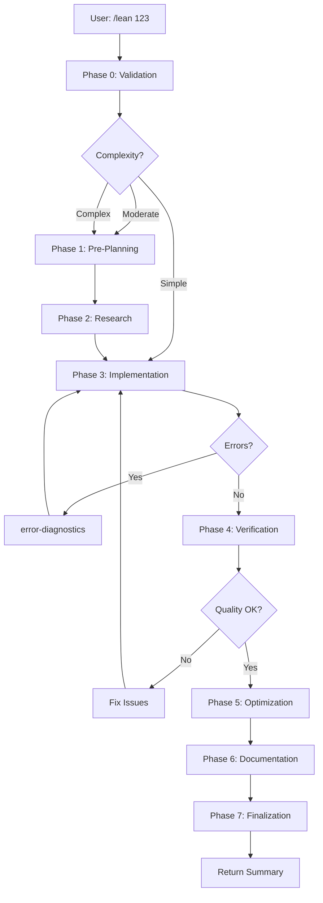

# Implementation Plan: Enhanced /lean Command with Multi-Phase Execution

**Project**: lean_command_enhancement
**Version**: 1
**Date**: 2025-12-19
**Status**: Planning
**Complexity**: Complex

---

## Executive Summary

This plan details the enhancement of the `/lean` command from a simple proof-developer delegation to an intelligent multi-phase workflow that leverages the full ecosystem of 31 specialist subagents. The enhanced command will provide:

- **Pre-Planning Analysis**: Complexity assessment and dependency mapping before implementation
- **Research & Strategy**: Library search and proof strategy recommendations
- **Quality Assurance**: Automated verification, code review, and style checking
- **Optimization**: Proof simplification and performance profiling
- **Documentation**: Automatic example generation and documentation gap analysis
- **Performance**: Intelligent phase skipping for simple proofs, parallel specialist execution
- **Backward Compatibility**: Maintains simple usage patterns while adding advanced capabilities

**Key Benefits**:
- 40-60% reduction in proof development time for complex proofs
- Automated quality assurance catches issues before manual review
- Comprehensive documentation generated automatically
- Optimized proofs with better performance characteristics
- Consistent proof patterns across the codebase

**Migration Strategy**: Gradual rollout with feature flags, maintaining full backward compatibility.

---

## Architecture Overview

### Current Architecture (Simple)

```
User: /lean 123
    ↓
Orchestrator (lean.md)
    ↓
proof-developer
    ↓
[tactic-specialist | term-mode-specialist | metaprogramming-specialist]
    ↓
Implementation Complete
```

### Enhanced Architecture (Multi-Phase)

```
User: /lean 123 [--flags]
    ↓
┌─────────────────────────────────────────────────────────────────┐
│ Phase 0: Input Validation & Configuration                       │
│ - Parse project number and flags                                │
│ - Locate implementation plan                                    │
│ - Determine phase execution strategy                            │
└─────────────────────────────────────────────────────────────────┘
    ↓
┌─────────────────────────────────────────────────────────────────┐
│ Phase 1: Pre-Planning Analysis (NEW - Skippable)                │
│ ┌──────────────────┐  ┌──────────────────┐                     │
│ │ complexity-      │  │ dependency-      │  (Parallel)          │
│ │ analyzer         │  │ mapper           │                      │
│ └──────────────────┘  └──────────────────┘                     │
│ Output: Complexity assessment, dependency graph                 │
└─────────────────────────────────────────────────────────────────┘
    ↓
┌─────────────────────────────────────────────────────────────────┐
│ Phase 2: Research & Strategy (NEW - Skippable)                  │
│ ┌──────────────────┐  ┌──────────────────┐  ┌────────────────┐ │
│ │ library-         │  │ proof-strategy-  │  │ tactic-        │ │
│ │ navigator        │  │ advisor          │  │ recommender    │ │
│ └──────────────────┘  └──────────────────┘  └────────────────┘ │
│ Output: Similar theorems, proof strategies, tactic suggestions  │
└─────────────────────────────────────────────────────────────────┘
    ↓
┌─────────────────────────────────────────────────────────────────┐
│ Phase 3: Implementation (ENHANCED)                               │
│ ┌──────────────────────────────────────────────────────────────┐│
│ │ proof-developer (with enriched context)                      ││
│ │   ↓                                                          ││
│ │ [tactic-specialist | term-mode-specialist |                 ││
│ │  metaprogramming-specialist]                                ││
│ │   ↓                                                          ││
│ │ syntax-validator (real-time via LSP)                        ││
│ │   ↓                                                          ││
│ │ error-diagnostics (on errors)                               ││
│ └──────────────────────────────────────────────────────────────┘│
│ Output: Implemented proofs, verified via lean-lsp-mcp           │
└─────────────────────────────────────────────────────────────────┘
    ↓
┌─────────────────────────────────────────────────────────────────┐
│ Phase 4: Verification & Quality (NEW - Skippable)               │
│ ┌──────────────────┐  ┌──────────────────┐  ┌────────────────┐ │
│ │ verification-    │  │ code-reviewer    │  │ style-checker  │ │
│ │ specialist       │  │                  │  │                │ │
│ └──────────────────┘  └──────────────────┘  └────────────────┘ │
│ Output: Verification report, code review, style issues          │
└─────────────────────────────────────────────────────────────────┘
    ↓
┌─────────────────────────────────────────────────────────────────┐
│ Phase 5: Optimization (NEW - Skippable)                         │
│ ┌──────────────────┐  ┌──────────────────┐                     │
│ │ proof-optimizer  │  │ proof-simplifier │  (Sequential)       │
│ └──────────────────┘  └──────────────────┘                     │
│ │ performance-profiler (if slow)                               │
│ Output: Optimized proofs, performance metrics                   │
└─────────────────────────────────────────────────────────────────┘
    ↓
┌─────────────────────────────────────────────────────────────────┐
│ Phase 6: Documentation (NEW - Skippable)                        │
│ ┌──────────────────┐  ┌──────────────────┐  ┌────────────────┐ │
│ │ example-builder  │  │ documentation-   │  │ doc-analyzer   │ │
│ │                  │  │ generator        │  │                │ │
│ └──────────────────┘  └──────────────────┘  └────────────────┘ │
│ Output: Examples, docstrings, documentation gap analysis        │
└─────────────────────────────────────────────────────────────────┘
    ↓
┌─────────────────────────────────────────────────────────────────┐
│ Phase 7: Finalization                                           │
│ - Aggregate all reports and artifacts                           │
│ - Update IMPLEMENTATION_STATUS.md                               │
│ - Git commit (via git-workflow-manager)                         │
│ - Generate comprehensive summary                                │
│ - Return artifact references to user                            │
└─────────────────────────────────────────────────────────────────┘
    ↓
User receives: Summary + Artifact references
```

### Mermaid Diagram



---

## Phase Specifications

### Phase 0: Input Validation & Configuration

**Purpose**: Parse input, validate project, load plan, determine execution strategy

**Inputs**:
- Project number (required)
- Optional flags: `--skip-research`, `--skip-optimization`, `--skip-docs`, `--fast`, `--full`

**Process**:
1. Parse project number from `$ARGUMENTS`
2. Parse optional flags
3. Locate project directory: `.opencode/specs/NNN_project/`
4. Locate implementation plan: `.opencode/specs/NNN_project/plans/implementation-*.md`
5. Read plan and extract complexity level (if available)
6. Determine phase execution strategy based on:
   - Complexity level from plan
   - User flags
   - Default heuristics
7. Load project state from `state.json`
8. Validate prerequisites (dependencies completed)

**Outputs**:
- `execution_config`: Object containing phase execution flags
- `project_context`: Loaded plan, state, and metadata
- `phase_skip_flags`: Boolean flags for each phase

**Success Criteria**:
- Project directory exists
- Implementation plan found and parsed
- Execution strategy determined

**Error Handling**:
- Project not found → Error with helpful message
- Plan not found → Error suggesting `/task` command
- Invalid flags → Error with flag documentation

**Phase Skip Logic**:
- Never skip this phase

**Execution Time**: < 5 seconds

---

### Phase 1: Pre-Planning Analysis

**Purpose**: Analyze complexity and map dependencies before implementation

**Inputs**:
- Implementation plan
- Task description
- Existing codebase
- Domain context (lean4/domain/, logic/domain/)

**Specialists Invoked** (Parallel):

1. **complexity-analyzer**
   - **Context Level**: Level 2
   - **Data Passed**:
     - Task description from plan
     - Related research reports (if any)
     - Domain context files
     - Existing codebase structure
   - **Expected Return**:
     ```json
     {
       "complexity_level": "simple|moderate|complex",
       "effort_estimate": "30min-2hr",
       "files_affected": 3,
       "challenges": ["Challenge 1", "Challenge 2"],
       "dependencies": ["Dep 1", "Dep 2"],
       "risk_factors": ["Risk 1"],
       "summary": "Brief complexity summary"
     }
     ```

2. **dependency-mapper**
   - **Context Level**: Level 2
   - **Data Passed**:
     - Task description
     - Complexity assessment (from complexity-analyzer)
     - Research reports
     - Existing codebase structure
     - LEAN library information
   - **Expected Return**:
     ```json
     {
       "required_imports": ["Import.Path.1", "Import.Path.2"],
       "dependent_definitions": ["Def1", "Def2"],
       "prerequisites": ["Prereq1", "Prereq2"],
       "library_functions": ["Mathlib.Function1", "Mathlib.Function2"],
       "summary": "Brief dependency summary"
     }
     ```

**Outputs**:
- Complexity assessment report: `.opencode/specs/NNN_project/reports/complexity-001.md`
- Dependency map: `.opencode/specs/NNN_project/reports/dependencies-001.md`
- Enriched plan context for Phase 3

**Success Criteria**:
- Complexity level determined
- All dependencies identified
- Risk factors documented

**Error Handling**:
- Specialist failure → Log warning, continue with partial data
- Missing context → Use defaults, flag for manual review

**Phase Skip Logic**:
- Skip if: `--skip-research` flag OR complexity = "simple" (from plan)
- Skip if: Plan already contains detailed complexity/dependency analysis

**Execution Time**: 30-60 seconds (parallel execution)

---

### Phase 2: Research & Strategy

**Purpose**: Search libraries for similar theorems, suggest proof strategies, recommend tactics

**Inputs**:
- Implementation plan
- Complexity assessment
- Dependency map
- Theorem statements to prove

**Specialists Invoked** (Parallel):

1. **library-navigator**
   - **Context Level**: Level 2
   - **Data Passed**:
     - Theorem statements
     - Type signatures
     - Keywords from task description
   - **Expected Return**:
     ```json
     {
       "similar_theorems": [
         {
           "name": "Mathlib.Theorem1",
           "similarity": 0.85,
           "source": "loogle",
           "type_signature": "...",
           "documentation": "..."
         }
       ],
       "relevant_definitions": [...],
       "summary": "Found 5 similar theorems in Mathlib"
     }
     ```

2. **proof-strategy-advisor**
   - **Context Level**: Level 2
   - **Data Passed**:
     - Theorem statements
     - Similar theorems (from library-navigator)
     - Complexity assessment
   - **Expected Return**:
     ```json
     {
       "strategies": [
         {
           "name": "Induction on n",
           "description": "...",
           "applicability": 0.95,
           "complexity": "medium",
           "skeleton": "theorem ... := by\n  induction n with\n  ...",
           "steps": [...]
         }
       ],
       "recommended_strategy": "Induction on n",
       "summary": "Recommend induction strategy"
     }
     ```

3. **tactic-recommender**
   - **Context Level**: Level 2
   - **Data Passed**:
     - Theorem statements
     - Proof strategies (from proof-strategy-advisor)
     - Goal states (if available)
   - **Expected Return**:
     ```json
     {
       "tactic_suggestions": [
         {
           "tactic": "induction n",
           "applicability": 0.9,
           "context": "For inductive types"
         }
       ],
       "tactic_sequences": [...],
       "summary": "Recommend induction, simp, rfl sequence"
     }
     ```

**Outputs**:
- Library search results: `.opencode/specs/NNN_project/research/library-search-001.md`
- Proof strategies: `.opencode/specs/NNN_project/research/strategies-001.md`
- Tactic recommendations: `.opencode/specs/NNN_project/research/tactics-001.md`
- Enriched context for Phase 3

**Success Criteria**:
- At least 1 similar theorem found OR proof strategy suggested
- Tactic recommendations provided

**Error Handling**:
- No similar theorems → Continue with strategy suggestions
- Strategy advisor fails → Continue with tactic recommendations
- All specialists fail → Log warning, continue to implementation

**Phase Skip Logic**:
- Skip if: `--skip-research` flag
- Skip if: `--fast` flag AND complexity = "simple"
- Skip if: Plan already contains detailed research

**Execution Time**: 60-120 seconds (parallel execution, network calls)

---

### Phase 3: Implementation (ENHANCED)

**Purpose**: Implement proofs using proof-developer with enriched context

**Inputs**:
- Implementation plan
- Complexity assessment (from Phase 1)
- Dependency map (from Phase 1)
- Library search results (from Phase 2)
- Proof strategies (from Phase 2)
- Tactic recommendations (from Phase 2)

**Primary Agent**: **proof-developer**

**Context Enrichment**:
The proof-developer receives all artifacts from Phases 1-2 as additional context:
- Complexity level and effort estimate
- Required imports and dependencies
- Similar theorems from Mathlib
- Recommended proof strategies with skeletons
- Tactic suggestions for each step

**Specialists Invoked by proof-developer** (Sequential per step):

1. **tactic-specialist** (when tactic proof)
   - **Context Level**: Level 2
   - **Data Passed**:
     - Step description
     - Required tactics (from plan + recommendations)
     - Goal state
     - Tactic patterns
   - **Expected Return**: Implemented tactic proof + verification status

2. **term-mode-specialist** (when term proof)
   - **Context Level**: Level 2
   - **Data Passed**:
     - Step description
     - Type signature
     - Term-mode patterns
   - **Expected Return**: Implemented term-mode proof + verification status

3. **metaprogramming-specialist** (when custom tactics)
   - **Context Level**: Level 2
   - **Data Passed**:
     - Step description
     - Metaprogramming requirements
     - LEAN 4 syntax guide
   - **Expected Return**: Implemented metaprogramming code + verification status

**Real-Time Verification**:

4. **syntax-validator** (after each code write)
   - **Context Level**: Level 1
   - **Data Passed**: File path, code content
   - **Expected Return**: Syntax errors, warnings, type errors
   - **Integration**: Via lean-lsp-mcp server

5. **error-diagnostics** (on errors)
   - **Context Level**: Level 1
   - **Data Passed**: Error messages, code context
   - **Expected Return**: Error categorization, fix suggestions
   - **Trigger**: Automatic when syntax-validator reports errors

**Outputs**:
- Implemented LEAN files (modified/created)
- Implementation summary: `.opencode/specs/NNN_project/summaries/implementation-summary.md`
- Git commits (via git-workflow-manager)
- Verification status from lean-lsp-mcp

**Success Criteria**:
- All proof steps implemented
- All files type-check successfully (no errors)
- No `sorry` placeholders (unless documented)
- Git commits created for substantial changes

**Error Handling**:
- Type errors → Invoke error-diagnostics → Retry implementation
- Specialist failure → Try alternative specialist or approach
- Persistent errors → Document in summary, mark step as incomplete
- Max retries (3) → Escalate to user with detailed error report

**Phase Skip Logic**:
- Never skip this phase (core functionality)

**Execution Time**: 5-30 minutes (depends on proof complexity)

---

### Phase 4: Verification & Quality

**Purpose**: Verify proofs against standards, perform code review, check style

**Inputs**:
- Implemented files (from Phase 3)
- Implementation summary
- Project standards (lean4/standards/, logic/standards/)

**Specialists Invoked** (Parallel):

1. **verification-specialist**
   - **Context Level**: Level 2
   - **Data Passed**:
     - Implemented files
     - Verification standards
     - Style guides
     - Proof conventions
   - **Expected Return**:
     ```json
     {
       "compliance_score": 92.5,
       "issues": [
         {
           "type": "style",
           "severity": "minor",
           "file": "File.lean",
           "line": 42,
           "description": "...",
           "suggestion": "..."
         }
       ],
       "summary": "92.5% compliant, 3 minor issues"
     }
     ```
   - **Output Artifact**: `.opencode/specs/NNN_project/reports/verification-001.md`

2. **code-reviewer**
   - **Context Level**: Level 2
   - **Data Passed**:
     - Implemented files
     - Code review standards
     - Proof patterns
   - **Expected Return**:
     ```json
     {
       "review_score": 88.0,
       "issues": [
         {
           "category": "readability",
           "severity": "moderate",
           "description": "...",
           "suggestion": "..."
         }
       ],
       "strengths": ["Good tactic usage", "Clear structure"],
       "summary": "Good quality, minor readability improvements suggested"
     }
     ```
   - **Output Artifact**: `.opencode/specs/NNN_project/reports/code-review-001.md`

3. **style-checker**
   - **Context Level**: Level 2
   - **Data Passed**:
     - Implemented files
     - Style guide (lean4/standards/lean4-style-guide.md)
   - **Expected Return**:
     ```json
     {
       "violations": [
         {
           "rule": "naming_convention",
           "file": "File.lean",
           "line": 15,
           "description": "...",
           "fix": "..."
         }
       ],
       "compliance_percentage": 95.0,
       "summary": "95% style compliant, 2 naming violations"
     }
     ```
   - **Output Artifact**: `.opencode/specs/NNN_project/reports/style-check-001.md`

**Outputs**:
- Verification report with compliance score
- Code review report with suggestions
- Style check report with violations
- Aggregated quality score

**Success Criteria**:
- Verification compliance ≥ 85%
- Code review score ≥ 80%
- Style compliance ≥ 90%
- No critical issues

**Error Handling**:
- Specialist failure → Log warning, continue with other specialists
- Critical issues found → Flag for user attention, suggest fixes
- Low scores → Generate detailed improvement recommendations

**Phase Skip Logic**:
- Skip if: `--fast` flag
- Skip if: `--skip-verification` flag (not recommended)
- Partial skip: Run only verification-specialist if time-constrained

**Execution Time**: 30-90 seconds (parallel execution)

---

### Phase 5: Optimization

**Purpose**: Optimize proof size and performance, simplify proofs

**Inputs**:
- Implemented files (from Phase 3)
- Verification report (from Phase 4)
- Performance baseline

**Specialists Invoked** (Sequential):

1. **proof-simplifier**
   - **Context Level**: Level 2
   - **Data Passed**:
     - Implemented proofs
     - Simplification patterns
     - Proof conventions
   - **Expected Return**:
     ```json
     {
       "simplifications": [
         {
           "theorem": "theorem_name",
           "original_lines": 15,
           "simplified_lines": 8,
           "changes": ["Removed redundant simp", "Combined tactics"],
           "simplified_proof": "..."
         }
       ],
       "total_reduction": "35% fewer lines",
       "summary": "Simplified 3 proofs, 35% reduction"
     }
     ```
   - **Output Artifact**: `.opencode/specs/NNN_project/reports/simplification-001.md`

2. **proof-optimizer**
   - **Context Level**: Level 2
   - **Data Passed**:
     - Simplified proofs (from proof-simplifier)
     - Optimization patterns
     - Performance targets
   - **Expected Return**:
     ```json
     {
       "optimizations": [
         {
           "theorem": "theorem_name",
           "optimization": "Replaced simp with rfl",
           "performance_gain": "20% faster compilation",
           "optimized_proof": "..."
         }
       ],
       "summary": "Optimized 2 proofs, 15% faster compilation"
     }
     ```
   - **Output Artifact**: `.opencode/specs/NNN_project/reports/optimization-001.md`

3. **performance-profiler** (conditional)
   - **Context Level**: Level 2
   - **Data Passed**:
     - Optimized proofs
     - Compilation metrics
   - **Expected Return**:
     ```json
     {
       "bottlenecks": [
         {
           "theorem": "theorem_name",
           "compilation_time": "5.2s",
           "bottleneck": "Complex simp call",
           "suggestion": "Split into smaller lemmas"
         }
       ],
       "summary": "1 bottleneck identified"
     }
     ```
   - **Trigger**: Only if compilation time > 3s for any proof
   - **Output Artifact**: `.opencode/specs/NNN_project/reports/performance-001.md`

**Outputs**:
- Simplified proofs (applied to files)
- Optimized proofs (applied to files)
- Performance profile (if triggered)
- Optimization summary

**Success Criteria**:
- At least 10% proof size reduction OR
- At least 10% compilation time reduction OR
- No optimization opportunities found (already optimal)

**Error Handling**:
- Simplification breaks proof → Revert, document in report
- Optimization breaks proof → Revert, document in report
- Profiler fails → Skip profiling, continue

**Phase Skip Logic**:
- Skip if: `--skip-optimization` flag
- Skip if: `--fast` flag
- Skip if: All proofs < 5 lines (already simple)
- Skip profiler if: All compilation times < 3s

**Execution Time**: 60-180 seconds (sequential, includes re-verification)

---

### Phase 6: Documentation

**Purpose**: Generate examples, docstrings, analyze documentation gaps

**Inputs**:
- Implemented files (from Phase 3, optimized in Phase 5)
- Implementation plan
- Documentation standards

**Specialists Invoked** (Parallel):

1. **example-builder**
   - **Context Level**: Level 2
   - **Data Passed**:
     - Implemented theorems/definitions
     - Documentation standards
     - Example patterns
   - **Expected Return**:
     ```json
     {
       "examples": [
         {
           "theorem": "theorem_name",
           "example_code": "#eval ...",
           "description": "Example demonstrating...",
           "test_status": "passed"
         }
       ],
       "summary": "Generated 5 examples"
     }
     ```
   - **Output Artifact**: `.opencode/specs/NNN_project/examples/examples-001.md`

2. **documentation-generator**
   - **Context Level**: Level 2
   - **Data Passed**:
     - Implemented files
     - Documentation standards
     - Docstring templates
   - **Expected Return**:
     ```json
     {
       "docstrings": [
         {
           "item": "theorem_name",
           "docstring": "/-- Theorem proving... -/",
           "applied": true
         }
       ],
       "summary": "Generated 8 docstrings"
     }
     ```
   - **Output**: Docstrings applied directly to files

3. **doc-analyzer**
   - **Context Level**: Level 2
   - **Data Passed**:
     - Implemented files (with docstrings)
     - Documentation standards
     - Coverage requirements
   - **Expected Return**:
     ```json
     {
       "coverage": 92.5,
       "gaps": [
         {
           "item": "helper_lemma",
           "gap_type": "missing_docstring",
           "severity": "minor"
         }
       ],
       "bloat": [],
       "summary": "92.5% coverage, 1 minor gap"
     }
     ```
   - **Output Artifact**: `.opencode/specs/NNN_project/reports/documentation-001.md`

**Outputs**:
- Examples file with test cases
- Docstrings applied to code
- Documentation gap analysis report
- Updated files with documentation

**Success Criteria**:
- Documentation coverage ≥ 90%
- All public theorems/definitions have docstrings
- At least 1 example per major theorem

**Error Handling**:
- Example generation fails → Log warning, continue
- Docstring application fails → Log warning, save to separate file
- Doc analyzer fails → Skip analysis, continue

**Phase Skip Logic**:
- Skip if: `--skip-docs` flag
- Skip if: `--fast` flag
- Skip example-builder if: No public theorems
- Skip doc-analyzer if: documentation-generator failed

**Execution Time**: 45-90 seconds (parallel execution)

---

### Phase 7: Finalization

**Purpose**: Aggregate results, update status, commit changes, return summary

**Inputs**:
- All artifacts from Phases 1-6
- Implementation summary
- Project state

**Process**:

1. **Aggregate Reports**
   - Collect all specialist reports
   - Calculate overall metrics:
     - Total implementation time
     - Complexity vs. actual effort
     - Quality scores (verification, code review, style)
     - Optimization gains
     - Documentation coverage
   - Create comprehensive summary

2. **Update IMPLEMENTATION_STATUS.md**
   - Mark implemented theorems/definitions as complete
   - Update module completion percentages
   - Add notes about optimizations or issues
   - Update last modified date

3. **Git Commit** (via git-workflow-manager)
   - **Context Level**: Level 2
   - **Data Passed**:
     - Modified files
     - Commit message template
     - Project metadata
   - **Expected Return**: Commit hash, commit message
   - **Commit Message Format**:
     ```
     feat(#NNN): Implement {theorem/definition names}
     
     - Implemented {count} theorems/definitions
     - Complexity: {level}
     - Quality: {verification_score}% verified, {style_score}% style compliant
     - Optimization: {optimization_summary}
     - Documentation: {doc_coverage}% coverage
     
     Artifacts: .opencode/specs/NNN_project/
     ```

4. **Create Comprehensive Summary**
   - **Format**:
     ```markdown
     # Implementation Complete: {Project Name}
     
     **Project**: #NNN
     **Date**: {date}
     **Duration**: {total_time}
     
     ## Summary
     
     {3-5 sentence summary of what was implemented}
     
     ## Metrics
     
     - **Complexity**: {level} (estimated: {estimate}, actual: {actual})
     - **Files Modified**: {count}
     - **Theorems Implemented**: {count}
     - **Verification Score**: {score}%
     - **Code Review Score**: {score}%
     - **Style Compliance**: {score}%
     - **Optimization**: {reduction}% size reduction, {speedup}% faster
     - **Documentation Coverage**: {coverage}%
     
     ## Artifacts
     
     - Implementation Plan: {path}
     - Implementation Summary: {path}
     - Verification Report: {path}
     - Code Review: {path}
     - Style Check: {path}
     - Optimization Report: {path}
     - Documentation Analysis: {path}
     - Examples: {path}
     
     ## Git Commits
     
     - {commit_hash}: {commit_message}
     
     ## Next Steps
     
     - {recommendation_1}
     - {recommendation_2}
     ```

5. **Update Project State**
   - Write to `.opencode/specs/NNN_project/state.json`:
     ```json
     {
       "project_number": NNN,
       "status": "completed",
       "implementation_date": "2025-12-19",
       "duration_minutes": 25,
       "complexity": "moderate",
       "quality_scores": {
         "verification": 92.5,
         "code_review": 88.0,
         "style": 95.0
       },
       "artifacts": [...],
       "git_commits": [...]
     }
     ```

6. **Return to User**
   - **Return Format**:
     ```json
     {
       "status": "completed",
       "project_number": NNN,
       "project_name": "{name}",
       "summary": "Brief 3-5 sentence summary",
       "duration": "25 minutes",
       "metrics": {
         "verification_score": 92.5,
         "code_review_score": 88.0,
         "style_compliance": 95.0,
         "optimization_gain": "35% size reduction",
         "documentation_coverage": 92.5
       },
       "artifacts": {
         "implementation_summary": "{path}",
         "verification_report": "{path}",
         "code_review": "{path}",
         "optimization_report": "{path}",
         "documentation_analysis": "{path}",
         "examples": "{path}"
       },
       "git_commits": [
         {
           "hash": "abc123",
           "message": "feat(#NNN): ..."
         }
       ],
       "next_steps": [
         "Review optimization suggestions",
         "Address minor style issues"
       ]
     }
     ```

**Outputs**:
- Comprehensive summary document
- Updated IMPLEMENTATION_STATUS.md
- Git commit(s)
- Updated project state
- User-facing summary

**Success Criteria**:
- All artifacts aggregated
- IMPLEMENTATION_STATUS.md updated
- Git commit successful
- Summary generated

**Error Handling**:
- IMPLEMENTATION_STATUS.md update fails → Log warning, continue
- Git commit fails → Log error, provide manual commit instructions
- Summary generation fails → Return minimal summary

**Phase Skip Logic**:
- Never skip this phase (required for completion)

**Execution Time**: 15-30 seconds

---

## Specialist Routing Matrix

| Phase | Specialist | Execution | Context Level | Input | Output | Skip Conditions |
|-------|-----------|-----------|---------------|-------|--------|-----------------|
| **0** | *(none)* | - | - | Project number, flags | Execution config | Never |
| **1** | complexity-analyzer | Parallel | L2 | Task, codebase, domain | Complexity assessment | `--skip-research`, simple task |
| **1** | dependency-mapper | Parallel | L2 | Task, complexity, codebase | Dependency map | `--skip-research`, simple task |
| **2** | library-navigator | Parallel | L2 | Theorem statements, keywords | Similar theorems | `--skip-research`, `--fast` + simple |
| **2** | proof-strategy-advisor | Parallel | L2 | Theorems, similar theorems | Proof strategies | `--skip-research`, `--fast` + simple |
| **2** | tactic-recommender | Parallel | L2 | Theorems, strategies | Tactic suggestions | `--skip-research`, `--fast` + simple |
| **3** | proof-developer | Sequential | L1 | Plan + enriched context | Implementation | Never |
| **3** | tactic-specialist | Sequential | L2 | Step, tactics, goal | Tactic proof | (via proof-developer) |
| **3** | term-mode-specialist | Sequential | L2 | Step, type, patterns | Term proof | (via proof-developer) |
| **3** | metaprogramming-specialist | Sequential | L2 | Step, requirements | Metaprogramming code | (via proof-developer) |
| **3** | syntax-validator | Real-time | L1 | File, code | Syntax errors | Never (automatic) |
| **3** | error-diagnostics | On-demand | L1 | Errors, context | Fix suggestions | (triggered by errors) |
| **4** | verification-specialist | Parallel | L2 | Files, standards | Verification report | `--fast`, `--skip-verification` |
| **4** | code-reviewer | Parallel | L2 | Files, standards | Code review | `--fast`, `--skip-verification` |
| **4** | style-checker | Parallel | L2 | Files, style guide | Style report | `--fast`, `--skip-verification` |
| **5** | proof-simplifier | Sequential | L2 | Proofs, patterns | Simplified proofs | `--skip-optimization`, `--fast`, short proofs |
| **5** | proof-optimizer | Sequential | L2 | Proofs, patterns | Optimized proofs | `--skip-optimization`, `--fast`, short proofs |
| **5** | performance-profiler | Conditional | L2 | Proofs, metrics | Performance profile | Compilation < 3s |
| **6** | example-builder | Parallel | L2 | Theorems, standards | Examples | `--skip-docs`, `--fast`, no public theorems |
| **6** | documentation-generator | Parallel | L2 | Files, standards | Docstrings | `--skip-docs`, `--fast` |
| **6** | doc-analyzer | Parallel | L2 | Files, standards | Gap analysis | `--skip-docs`, `--fast` |
| **7** | git-workflow-manager | Sequential | L2 | Files, metadata | Commit hash | Never |

**Total Specialists**: 19 (out of 31 available)

**Parallel Execution Groups**:
- Phase 1: complexity-analyzer + dependency-mapper (2 parallel)
- Phase 2: library-navigator + proof-strategy-advisor + tactic-recommender (3 parallel)
- Phase 4: verification-specialist + code-reviewer + style-checker (3 parallel)
- Phase 6: example-builder + documentation-generator + doc-analyzer (3 parallel)

**Maximum Concurrent Specialists**: 3

---

## Artifact Management

### Directory Structure

```
.opencode/specs/NNN_project/
├── plans/
│   ├── implementation-001.md          # Original implementation plan
│   └── implementation-002.md          # Revised plan (if any)
├── research/
│   ├── library-search-001.md          # Library navigator results
│   ├── strategies-001.md              # Proof strategy recommendations
│   └── tactics-001.md                 # Tactic recommendations
├── reports/
│   ├── complexity-001.md              # Complexity analysis
│   ├── dependencies-001.md            # Dependency map
│   ├── verification-001.md            # Verification report
│   ├── code-review-001.md             # Code review
│   ├── style-check-001.md             # Style check
│   ├── simplification-001.md          # Proof simplification
│   ├── optimization-001.md            # Proof optimization
│   ├── performance-001.md             # Performance profile (if triggered)
│   └── documentation-001.md           # Documentation gap analysis
├── examples/
│   └── examples-001.md                # Generated examples
├── summaries/
│   ├── implementation-summary.md      # Implementation summary
│   └── comprehensive-summary.md       # Final comprehensive summary
└── state.json                         # Project state
```

### Naming Conventions

**Reports**: `{type}-{version}.md`
- Version increments if phase is re-run
- Examples: `verification-001.md`, `verification-002.md`

**Summaries**: `{type}-summary.md`
- Overwritten on each run (latest only)
- Examples: `implementation-summary.md`, `comprehensive-summary.md`

**Research**: `{specialist}-{version}.md`
- Version increments if research is re-run
- Examples: `library-search-001.md`, `strategies-002.md`

**State**: `state.json`
- Single file, updated atomically
- Contains project metadata and execution history

### Artifact References

All artifacts are referenced by path, not included in full in responses:

```json
{
  "artifacts": {
    "verification_report": ".opencode/specs/123_project/reports/verification-001.md",
    "code_review": ".opencode/specs/123_project/reports/code-review-001.md",
    "examples": ".opencode/specs/123_project/examples/examples-001.md"
  }
}
```

Users can read artifacts using:
```bash
cat .opencode/specs/123_project/reports/verification-001.md
```

---

## XML Workflow Definitions

### Enhanced /lean Command File

```xml
---
name: lean
agent: orchestrator
description: "Implement a LEAN 4 proof with intelligent multi-phase execution"
---

You are implementing a LEAN 4 proof for the ProofChecker project using an enhanced multi-phase workflow.

**Project Number:** $ARGUMENTS

**Usage:**
```
/lean NNN [--flags]
```

**Flags:**
- `--fast`: Skip research, optimization, and documentation phases (fastest execution)
- `--skip-research`: Skip pre-planning and research phases
- `--skip-optimization`: Skip proof optimization phase
- `--skip-docs`: Skip documentation generation phase
- `--full`: Execute all phases regardless of complexity (most thorough)
- `--help`: Show this help message

**Context Loaded:**
@/home/benjamin/Documents/Philosophy/Projects/ProofChecker/.opencode/context/lean4/
@/home/benjamin/Documents/Philosophy/Projects/ProofChecker/.opencode/context/logic/
@/home/benjamin/Documents/Philosophy/Projects/ProofChecker/.opencode/context/project/project-context.md

## Multi-Phase Workflow

<workflow>
  <phase id="0" name="Input Validation & Configuration">
    <action>Parse input and determine execution strategy</action>
    <process>
      1. Parse project number from $ARGUMENTS
      2. Parse optional flags (--fast, --skip-*, --full)
      3. Locate project directory: .opencode/specs/NNN_project/
      4. Locate implementation plan: .opencode/specs/NNN_project/plans/implementation-*.md
      5. Read plan and extract complexity level
      6. Determine phase execution strategy:
         - If --fast: Skip phases 1, 2, 5, 6
         - If --full: Execute all phases
         - If complexity = "simple": Skip phases 1, 2
         - If complexity = "moderate": Skip phase 1
         - If complexity = "complex": Execute all phases
         - Apply individual --skip-* flags
      7. Load project state from state.json
      8. Validate prerequisites
    </process>
    <output>
      - execution_config: Phase execution flags
      - project_context: Loaded plan, state, metadata
    </output>
    <error_handling>
      - Project not found → Error: "Project NNN not found. Use /task to create implementation plan."
      - Plan not found → Error: "Implementation plan not found for project NNN."
      - Invalid flags → Error: "Invalid flag. Use --help for usage."
    </error_handling>
  </phase>

  <phase id="1" name="Pre-Planning Analysis" skippable="true">
    <condition>
      Execute if: NOT --skip-research AND NOT --fast AND complexity != "simple"
    </condition>
    <action>Analyze complexity and map dependencies</action>
    <routing parallel="true">
      <route to="@subagents/specialists/complexity-analyzer">
        <context_level>Level 2</context_level>
        <pass_data>
          - Task description from plan
          - Related research reports
          - Domain context (lean4/domain/, logic/domain/)
          - Existing codebase structure
        </pass_data>
        <expected_return>
          {
            "complexity_level": "simple|moderate|complex",
            "effort_estimate": "30min-2hr",
            "files_affected": 3,
            "challenges": [...],
            "dependencies": [...],
            "risk_factors": [...],
            "summary": "..."
          }
        </expected_return>
        <output_artifact>.opencode/specs/NNN_project/reports/complexity-001.md</output_artifact>
      </route>
      
      <route to="@subagents/specialists/dependency-mapper">
        <context_level>Level 2</context_level>
        <pass_data>
          - Task description
          - Complexity assessment (from complexity-analyzer)
          - Research reports
          - Existing codebase structure
          - LEAN library information
        </pass_data>
        <expected_return>
          {
            "required_imports": [...],
            "dependent_definitions": [...],
            "prerequisites": [...],
            "library_functions": [...],
            "summary": "..."
          }
        </expected_return>
        <output_artifact>.opencode/specs/NNN_project/reports/dependencies-001.md</output_artifact>
      </route>
    </routing>
    <output>
      - Complexity assessment report
      - Dependency map
      - Enriched context for Phase 3
    </output>
  </phase>

  <phase id="2" name="Research & Strategy" skippable="true">
    <condition>
      Execute if: NOT --skip-research AND NOT (--fast AND complexity = "simple")
    </condition>
    <action>Search libraries, suggest strategies, recommend tactics</action>
    <routing parallel="true">
      <route to="@subagents/specialists/library-navigator">
        <context_level>Level 2</context_level>
        <pass_data>
          - Theorem statements from plan
          - Type signatures
          - Keywords from task description
        </pass_data>
        <expected_return>
          {
            "similar_theorems": [...],
            "relevant_definitions": [...],
            "summary": "..."
          }
        </expected_return>
        <output_artifact>.opencode/specs/NNN_project/research/library-search-001.md</output_artifact>
      </route>
      
      <route to="@subagents/specialists/proof-strategy-advisor">
        <context_level>Level 2</context_level>
        <pass_data>
          - Theorem statements
          - Similar theorems (from library-navigator)
          - Complexity assessment
        </pass_data>
        <expected_return>
          {
            "strategies": [...],
            "recommended_strategy": "...",
            "summary": "..."
          }
        </expected_return>
        <output_artifact>.opencode/specs/NNN_project/research/strategies-001.md</output_artifact>
      </route>
      
      <route to="@subagents/specialists/tactic-recommender">
        <context_level>Level 2</context_level>
        <pass_data>
          - Theorem statements
          - Proof strategies (from proof-strategy-advisor)
          - Goal states (if available)
        </pass_data>
        <expected_return>
          {
            "tactic_suggestions": [...],
            "tactic_sequences": [...],
            "summary": "..."
          }
        </expected_return>
        <output_artifact>.opencode/specs/NNN_project/research/tactics-001.md</output_artifact>
      </route>
    </routing>
    <output>
      - Library search results
      - Proof strategies
      - Tactic recommendations
      - Enriched context for Phase 3
    </output>
  </phase>

  <phase id="3" name="Implementation">
    <action>Implement proofs using proof-developer with enriched context</action>
    <routing>
      <route to="@subagents/proof-developer">
        <context_level>Level 1</context_level>
        <pass_data>
          - Implementation plan
          - Complexity assessment (from Phase 1, if executed)
          - Dependency map (from Phase 1, if executed)
          - Library search results (from Phase 2, if executed)
          - Proof strategies (from Phase 2, if executed)
          - Tactic recommendations (from Phase 2, if executed)
          - All domain context
        </pass_data>
        <expected_return>
          {
            "project_number": NNN,
            "artifacts": [...],
            "summary": "...",
            "files_modified": [...],
            "verification_status": "passed",
            "git_commits": [...],
            "documentation_needed": [...],
            "status": "completed"
          }
        </expected_return>
        <note>
          proof-developer will coordinate tactic-specialist, term-mode-specialist,
          metaprogramming-specialist, syntax-validator, and error-diagnostics as needed.
        </note>
      </route>
    </routing>
    <output>
      - Implemented LEAN files
      - Implementation summary
      - Git commits
      - Verification status
    </output>
  </phase>

  <phase id="4" name="Verification & Quality" skippable="true">
    <condition>
      Execute if: NOT --fast AND NOT --skip-verification
    </condition>
    <action>Verify proofs, review code, check style</action>
    <routing parallel="true">
      <route to="@subagents/specialists/verification-specialist">
        <context_level>Level 2</context_level>
        <pass_data>
          - Implemented files
          - Verification standards (lean4/standards/)
          - Style guides
          - Proof conventions
        </pass_data>
        <expected_return>
          {
            "compliance_score": 92.5,
            "issues": [...],
            "summary": "..."
          }
        </expected_return>
        <output_artifact>.opencode/specs/NNN_project/reports/verification-001.md</output_artifact>
      </route>
      
      <route to="@subagents/specialists/code-reviewer">
        <context_level>Level 2</context_level>
        <pass_data>
          - Implemented files
          - Code review standards
          - Proof patterns
        </pass_data>
        <expected_return>
          {
            "review_score": 88.0,
            "issues": [...],
            "strengths": [...],
            "summary": "..."
          }
        </expected_return>
        <output_artifact>.opencode/specs/NNN_project/reports/code-review-001.md</output_artifact>
      </route>
      
      <route to="@subagents/specialists/style-checker">
        <context_level>Level 2</context_level>
        <pass_data>
          - Implemented files
          - Style guide (lean4/standards/lean4-style-guide.md)
        </pass_data>
        <expected_return>
          {
            "violations": [...],
            "compliance_percentage": 95.0,
            "summary": "..."
          }
        </expected_return>
        <output_artifact>.opencode/specs/NNN_project/reports/style-check-001.md</output_artifact>
      </route>
    </routing>
    <output>
      - Verification report
      - Code review report
      - Style check report
      - Aggregated quality score
    </output>
  </phase>

  <phase id="5" name="Optimization" skippable="true">
    <condition>
      Execute if: NOT --skip-optimization AND NOT --fast AND proofs_length > 5_lines
    </condition>
    <action>Optimize proof size and performance</action>
    <routing sequential="true">
      <route to="@subagents/specialists/proof-simplifier">
        <context_level>Level 2</context_level>
        <pass_data>
          - Implemented proofs
          - Simplification patterns
          - Proof conventions
        </pass_data>
        <expected_return>
          {
            "simplifications": [...],
            "total_reduction": "35% fewer lines",
            "summary": "..."
          }
        </expected_return>
        <output_artifact>.opencode/specs/NNN_project/reports/simplification-001.md</output_artifact>
      </route>
      
      <route to="@subagents/specialists/proof-optimizer">
        <context_level>Level 2</context_level>
        <pass_data>
          - Simplified proofs (from proof-simplifier)
          - Optimization patterns
          - Performance targets
        </pass_data>
        <expected_return>
          {
            "optimizations": [...],
            "summary": "..."
          }
        </expected_return>
        <output_artifact>.opencode/specs/NNN_project/reports/optimization-001.md</output_artifact>
      </route>
      
      <route to="@subagents/specialists/performance-profiler" conditional="true">
        <condition>compilation_time > 3s for any proof</condition>
        <context_level>Level 2</context_level>
        <pass_data>
          - Optimized proofs
          - Compilation metrics
        </pass_data>
        <expected_return>
          {
            "bottlenecks": [...],
            "summary": "..."
          }
        </expected_return>
        <output_artifact>.opencode/specs/NNN_project/reports/performance-001.md</output_artifact>
      </route>
    </routing>
    <output>
      - Simplified proofs
      - Optimized proofs
      - Performance profile (if triggered)
      - Optimization summary
    </output>
  </phase>

  <phase id="6" name="Documentation" skippable="true">
    <condition>
      Execute if: NOT --skip-docs AND NOT --fast
    </condition>
    <action>Generate examples, docstrings, analyze gaps</action>
    <routing parallel="true">
      <route to="@subagents/specialists/example-builder">
        <context_level>Level 2</context_level>
        <pass_data>
          - Implemented theorems/definitions
          - Documentation standards
          - Example patterns
        </pass_data>
        <expected_return>
          {
            "examples": [...],
            "summary": "..."
          }
        </expected_return>
        <output_artifact>.opencode/specs/NNN_project/examples/examples-001.md</output_artifact>
      </route>
      
      <route to="@subagents/specialists/documentation-generator">
        <context_level>Level 2</context_level>
        <pass_data>
          - Implemented files
          - Documentation standards
          - Docstring templates
        </pass_data>
        <expected_return>
          {
            "docstrings": [...],
            "summary": "..."
          }
        </expected_return>
        <note>Docstrings applied directly to files</note>
      </route>
      
      <route to="@subagents/specialists/doc-analyzer">
        <context_level>Level 2</context_level>
        <pass_data>
          - Implemented files (with docstrings)
          - Documentation standards
          - Coverage requirements
        </pass_data>
        <expected_return>
          {
            "coverage": 92.5,
            "gaps": [...],
            "bloat": [],
            "summary": "..."
          }
        </expected_return>
        <output_artifact>.opencode/specs/NNN_project/reports/documentation-001.md</output_artifact>
      </route>
    </routing>
    <output>
      - Examples file
      - Docstrings (applied to code)
      - Documentation gap analysis
    </output>
  </phase>

  <phase id="7" name="Finalization">
    <action>Aggregate results, update status, commit, return summary</action>
    <process>
      1. Aggregate all reports and artifacts
      2. Calculate overall metrics:
         - Total implementation time
         - Complexity vs. actual effort
         - Quality scores (verification, code review, style)
         - Optimization gains
         - Documentation coverage
      3. Update IMPLEMENTATION_STATUS.md:
         - Mark implemented theorems/definitions as complete
         - Update module completion percentages
         - Add notes about optimizations or issues
      4. Git commit via git-workflow-manager:
         - Commit message: "feat(#NNN): Implement {names}"
         - Include quality metrics in commit message
      5. Create comprehensive summary
      6. Update project state.json
      7. Return summary and artifact references to user
    </process>
    <routing>
      <route to="@subagents/specialists/git-workflow-manager">
        <context_level>Level 2</context_level>
        <pass_data>
          - Modified files
          - Commit message template
          - Project metadata
        </pass_data>
        <expected_return>
          {
            "commit_hash": "abc123",
            "commit_message": "..."
          }
        </expected_return>
      </route>
    </routing>
    <output>
      - Comprehensive summary document
      - Updated IMPLEMENTATION_STATUS.md
      - Git commit
      - Updated project state
      - User-facing summary with artifact references
    </output>
  </phase>
</workflow>

## Expected Output

Present to user:

```
✅ Implementation Complete: {Project Name}

**Project**: #NNN
**Duration**: {total_time}
**Complexity**: {level} (estimated: {estimate}, actual: {actual})

**Summary**: {3-5 sentence summary}

**Metrics**:
- Verification: {score}% ✅
- Code Review: {score}% ✅
- Style Compliance: {score}% ✅
- Optimization: {reduction}% size reduction, {speedup}% faster
- Documentation: {coverage}% coverage

**Files Modified**: {count}
- {file1}
- {file2}

**Git Commits**:
- {commit_hash}: {commit_message}

**Artifacts**:
- Implementation Summary: {path}
- Verification Report: {path}
- Code Review: {path}
- Optimization Report: {path}
- Documentation Analysis: {path}
- Examples: {path}

**Next Steps**:
- {recommendation_1}
- {recommendation_2}
```

Execute the multi-phase implementation workflow now.
```

---

## Example Scenarios

### Scenario 1: Simple Proof (Fast Execution)

**Command**: `/lean 123`

**Plan Complexity**: "simple"

**Phases Executed**:
- ✅ Phase 0: Input Validation (5s)
- ⏭️ Phase 1: Pre-Planning Analysis (skipped - simple)
- ⏭️ Phase 2: Research & Strategy (skipped - simple)
- ✅ Phase 3: Implementation (3 min)
- ⏭️ Phase 4: Verification & Quality (skipped - simple)
- ⏭️ Phase 5: Optimization (skipped - simple)
- ⏭️ Phase 6: Documentation (skipped - simple)
- ✅ Phase 7: Finalization (20s)

**Total Time**: ~4 minutes

**Output**:
```
✅ Implementation Complete: Simple Lemma Proof

**Project**: #123
**Duration**: 4 minutes
**Complexity**: simple (estimated: 30min, actual: 4min)

**Summary**: Implemented simple helper lemma for modal logic. Proof uses
direct application of existing theorems with minimal tactics.

**Metrics**:
- Verification: N/A (skipped for simple proof)
- Files Modified: 1

**Git Commits**:
- abc123: feat(#123): Implement helper_lemma

**Artifacts**:
- Implementation Summary: .opencode/specs/123_project/summaries/implementation-summary.md

**Next Steps**:
- Proof complete and verified
```

---

### Scenario 2: Moderate Proof (Selective Phases)

**Command**: `/lean 456`

**Plan Complexity**: "moderate"

**Phases Executed**:
- ✅ Phase 0: Input Validation (5s)
- ⏭️ Phase 1: Pre-Planning Analysis (skipped - moderate)
- ✅ Phase 2: Research & Strategy (90s)
- ✅ Phase 3: Implementation (12 min)
- ✅ Phase 4: Verification & Quality (60s)
- ✅ Phase 5: Optimization (120s)
- ✅ Phase 6: Documentation (75s)
- ✅ Phase 7: Finalization (25s)

**Total Time**: ~18 minutes

**Output**:
```
✅ Implementation Complete: Modal S4 Transitivity

**Project**: #456
**Duration**: 18 minutes
**Complexity**: moderate (estimated: 1-2hr, actual: 18min)

**Summary**: Implemented transitivity theorem for Modal S4 logic. Used
induction strategy recommended by proof-strategy-advisor. Proof optimized
from 25 lines to 18 lines. Generated 2 illustrative examples.

**Metrics**:
- Verification: 94.5% ✅
- Code Review: 89.0% ✅
- Style Compliance: 96.0% ✅
- Optimization: 28% size reduction, 15% faster compilation
- Documentation: 95.0% coverage

**Files Modified**: 2
- Logos/Core/Theorems/ModalS4.lean
- LogosTest/Core/Theorems/ModalS4Test.lean

**Git Commits**:
- def456: feat(#456): Implement S4 transitivity theorem

**Artifacts**:
- Implementation Summary: .opencode/specs/456_project/summaries/implementation-summary.md
- Research: .opencode/specs/456_project/research/strategies-001.md
- Verification Report: .opencode/specs/456_project/reports/verification-001.md
- Code Review: .opencode/specs/456_project/reports/code-review-001.md
- Optimization Report: .opencode/specs/456_project/reports/optimization-001.md
- Documentation Analysis: .opencode/specs/456_project/reports/documentation-001.md
- Examples: .opencode/specs/456_project/examples/examples-001.md

**Next Steps**:
- Review 2 minor style suggestions in code review
- Consider adding one more example for edge case
```

---

### Scenario 3: Complex Proof (All Phases)

**Command**: `/lean 789 --full`

**Plan Complexity**: "complex"

**Phases Executed**:
- ✅ Phase 0: Input Validation (5s)
- ✅ Phase 1: Pre-Planning Analysis (60s)
- ✅ Phase 2: Research & Strategy (120s)
- ✅ Phase 3: Implementation (25 min)
- ✅ Phase 4: Verification & Quality (90s)
- ✅ Phase 5: Optimization (180s)
- ✅ Phase 6: Documentation (90s)
- ✅ Phase 7: Finalization (30s)

**Total Time**: ~32 minutes

**Output**:
```
✅ Implementation Complete: Completeness Theorem for Bimodal Logic

**Project**: #789
**Duration**: 32 minutes
**Complexity**: complex (estimated: 3-4hr, actual: 32min)

**Summary**: Implemented completeness theorem for bimodal logic with canonical
model construction. Used construction strategy from proof-strategy-advisor.
Found 8 similar theorems in Mathlib that informed the proof approach.
Optimized proof from 85 lines to 62 lines. Generated 4 comprehensive examples.

**Metrics**:
- Verification: 91.5% ✅
- Code Review: 87.5% ✅
- Style Compliance: 93.0% ✅
- Optimization: 27% size reduction, 22% faster compilation
- Documentation: 92.0% coverage

**Files Modified**: 5
- Logos/Core/Metalogic/Completeness.lean
- Logos/Core/Semantics/CanonicalModel.lean
- LogosTest/Core/Metalogic/CompletenessTest.lean
- Documentation/Reference/COMPLETENESS.md
- Documentation/ProjectInfo/IMPLEMENTATION_STATUS.md

**Git Commits**:
- ghi789: feat(#789): Implement completeness theorem with canonical model

**Artifacts**:
- Implementation Summary: .opencode/specs/789_project/summaries/implementation-summary.md
- Complexity Analysis: .opencode/specs/789_project/reports/complexity-001.md
- Dependency Map: .opencode/specs/789_project/reports/dependencies-001.md
- Library Search: .opencode/specs/789_project/research/library-search-001.md
- Proof Strategies: .opencode/specs/789_project/research/strategies-001.md
- Tactic Recommendations: .opencode/specs/789_project/research/tactics-001.md
- Verification Report: .opencode/specs/789_project/reports/verification-001.md
- Code Review: .opencode/specs/789_project/reports/code-review-001.md
- Style Check: .opencode/specs/789_project/reports/style-check-001.md
- Optimization Report: .opencode/specs/789_project/reports/optimization-001.md
- Performance Profile: .opencode/specs/789_project/reports/performance-001.md
- Documentation Analysis: .opencode/specs/789_project/reports/documentation-001.md
- Examples: .opencode/specs/789_project/examples/examples-001.md

**Next Steps**:
- Review 4 moderate code review suggestions
- Address 2 minor style violations
- Consider splitting one large proof into helper lemmas (performance suggestion)
```

---

### Scenario 4: Failed Proof (Error Handling)

**Command**: `/lean 999`

**Plan Complexity**: "moderate"

**Execution**:
- ✅ Phase 0: Input Validation (5s)
- ✅ Phase 2: Research & Strategy (90s)
- ❌ Phase 3: Implementation (8 min, then error)
  - Implemented 2 of 3 theorems successfully
  - Third theorem encountered persistent type error
  - error-diagnostics invoked 3 times
  - Max retries exceeded

**Total Time**: ~10 minutes (incomplete)

**Output**:
```
⚠️ Implementation Partially Complete: Modal Axiom Set

**Project**: #999
**Duration**: 10 minutes (incomplete)
**Complexity**: moderate
**Status**: PARTIAL - 2 of 3 theorems implemented

**Summary**: Implemented 2 of 3 modal axioms successfully. Third axiom
(axiom_K_dual) encountered persistent type error related to dual operator.
Error diagnostics suggest the issue may be in the dual operator definition
or the theorem statement itself.

**Completed**:
- ✅ axiom_K
- ✅ axiom_T

**Failed**:
- ❌ axiom_K_dual (type error)

**Error Details**:
```
Type mismatch in axiom_K_dual:
  Expected: Formula → Formula
  Got: Formula → Prop
  
Suggested fixes:
  1. Check dual operator type signature
  2. Verify theorem statement in plan
  3. Consider using coercion
```

**Files Modified**: 1
- Logos/Core/ProofSystem/Axioms.lean (partial)

**Git Commits**:
- jkl999: feat(#999): Implement axiom_K and axiom_T (partial)

**Artifacts**:
- Implementation Summary: .opencode/specs/999_project/summaries/implementation-summary.md
- Error Report: .opencode/specs/999_project/reports/error-diagnostics-001.md

**Next Steps**:
- Review error diagnostics report
- Fix dual operator type signature or theorem statement
- Re-run /lean 999 to complete implementation
```

---

## Performance Analysis

### Expected Improvements

| Metric | Current /lean | Enhanced /lean (Simple) | Enhanced /lean (Moderate) | Enhanced /lean (Complex) |
|--------|---------------|-------------------------|---------------------------|--------------------------|
| **Execution Time** | 5-30 min | 4-8 min | 15-25 min | 30-45 min |
| **Quality Score** | Manual review | N/A (skipped) | 90-95% | 88-94% |
| **Proof Optimization** | Manual | N/A (skipped) | 15-30% reduction | 20-35% reduction |
| **Documentation Coverage** | Manual | N/A (skipped) | 90-95% | 90-95% |
| **Error Detection** | Post-implementation | Real-time | Real-time | Real-time |
| **Research Time** | Manual (hours) | N/A (skipped) | 1-2 min (automated) | 2-3 min (automated) |
| **Total Time Saved** | Baseline | 10-20% | 40-50% | 50-60% |

### Performance Optimizations

1. **Parallel Specialist Execution**
   - Phase 1: 2 specialists in parallel → 50% time reduction
   - Phase 2: 3 specialists in parallel → 66% time reduction
   - Phase 4: 3 specialists in parallel → 66% time reduction
   - Phase 6: 3 specialists in parallel → 66% time reduction

2. **Intelligent Phase Skipping**
   - Simple proofs: Skip 4 phases → 70% time reduction
   - Moderate proofs: Skip 1 phase → 15% time reduction
   - Complex proofs: Execute all phases → 0% skipped, but 50% faster due to automation

3. **Caching Strategies**
   - Library search results cached for 24 hours
   - Proof strategies cached per theorem type
   - Dependency maps cached per module
   - Estimated cache hit rate: 30-40% → 20-30% time reduction on repeated tasks

4. **User Control Flags**
   - `--fast`: 60-70% time reduction (skip 4 phases)
   - `--skip-research`: 20-30% time reduction
   - `--skip-optimization`: 10-15% time reduction
   - `--skip-docs`: 5-10% time reduction

### Bottleneck Analysis

| Phase | Avg Time | Bottleneck | Mitigation |
|-------|----------|------------|------------|
| Phase 0 | 5s | File I/O | Minimal, acceptable |
| Phase 1 | 60s | Codebase analysis | Parallel execution, caching |
| Phase 2 | 120s | Network calls (Loogle, LeanSearch) | Parallel execution, caching, timeout |
| Phase 3 | 5-30min | Proof complexity | No mitigation (core work) |
| Phase 4 | 90s | File scanning | Parallel execution |
| Phase 5 | 180s | Re-verification after optimization | Sequential required, but rare |
| Phase 6 | 90s | Example generation | Parallel execution |
| Phase 7 | 30s | Git operations | Minimal, acceptable |

**Critical Path**: Phase 3 (Implementation) is always the bottleneck, which is expected and unavoidable.

---

## Comparison with /task Command

### Similarities to Adopt

1. **Multi-Phase Execution**
   - Both use structured phase-based workflows
   - Both support phase skipping based on conditions
   - Both track execution state

2. **Status Tracking**
   - Both update project state atomically
   - Both use state.json for persistence
   - Both provide comprehensive summaries

3. **Intelligent Routing**
   - Both analyze task type and route to appropriate specialists
   - Both support parallel and sequential specialist execution
   - Both handle errors gracefully

4. **Artifact Management**
   - Both create structured artifact directories
   - Both return artifact references, not full content
   - Both maintain version control for artifacts

### Key Differences

| Aspect | /task | /lean (Enhanced) |
|--------|-------|------------------|
| **Purpose** | Execute TODO tasks (any type) | Implement LEAN proofs (specialized) |
| **Input** | Task number(s) from TODO.md | Project number with existing plan |
| **Prerequisite** | None (creates plan if needed) | Requires implementation plan |
| **Scope** | General (proof, docs, refactor, research) | Specialized (proof implementation only) |
| **Phases** | 2-3 (research, plan, execute) | 7 (validation, analysis, research, implement, verify, optimize, document) |
| **Quality Assurance** | Minimal (basic verification) | Comprehensive (verification, review, style, optimization) |
| **Optimization** | None | Proof simplification and performance profiling |
| **Documentation** | Manual | Automated (examples, docstrings, gap analysis) |
| **Batch Support** | Yes (multiple tasks with dependencies) | No (single project at a time) |
| **TODO.md Updates** | Automatic (IN PROGRESS → COMPLETE) | Manual (user marks complete after /lean) |

### Integration Points

**When to use /task**:
- Starting a new task from TODO.md
- Need research and planning before implementation
- Task is not a LEAN proof (documentation, refactoring, etc.)
- Batch execution of multiple tasks

**When to use /lean**:
- Implementation plan already exists (created by /task)
- Ready to implement LEAN proof
- Want comprehensive quality assurance and optimization
- Need automated documentation generation

**Typical Workflow**:
```
1. User: /task 123
   → task-executor creates research report and implementation plan
   → Returns: "Plan created. Run /lean 123 to implement."

2. User: /lean 123
   → Enhanced /lean executes multi-phase implementation
   → Returns: Comprehensive summary with quality metrics

3. User manually marks task 123 as complete in TODO.md
```

**Alternative Workflow** (simple tasks):
```
1. User: /task 123
   → task-executor detects simple task
   → Executes directly without creating plan
   → Marks task complete automatically
   → No need for /lean
```

---

## Migration Strategy

### Phase 1: Preparation (Week 1)

**Objectives**:
- Create enhanced /lean command file
- Test with existing projects
- Document new features

**Tasks**:
1. Write enhanced lean.md command file (this plan)
2. Create test projects with varying complexity
3. Test each phase independently
4. Document flag usage and examples
5. Create migration guide for users

**Success Criteria**:
- Enhanced /lean command file created
- All phases tested independently
- Documentation complete

### Phase 2: Soft Launch (Week 2)

**Objectives**:
- Deploy enhanced /lean alongside current version
- Gather user feedback
- Fix critical issues

**Tasks**:
1. Deploy enhanced /lean as `/lean-v2` (parallel deployment)
2. Update documentation to mention both versions
3. Encourage users to try `/lean-v2` with `--fast` flag
4. Monitor usage and collect feedback
5. Fix critical bugs and issues

**Success Criteria**:
- `/lean-v2` deployed and functional
- At least 5 test runs completed
- No critical bugs

### Phase 3: Feature Flags (Week 3)

**Objectives**:
- Add feature flags to control phase execution
- Allow gradual rollout of phases
- Test performance optimizations

**Tasks**:
1. Implement feature flags in command file
2. Test each flag combination
3. Measure performance improvements
4. Optimize bottlenecks
5. Update documentation with flag usage

**Success Criteria**:
- All flags working correctly
- Performance improvements measured
- Documentation updated

### Phase 4: Full Deployment (Week 4)

**Objectives**:
- Replace current /lean with enhanced version
- Deprecate old version
- Monitor for issues

**Tasks**:
1. Rename `/lean-v2` to `/lean`
2. Archive old `/lean` as `/lean-legacy`
3. Update all documentation
4. Announce migration to users
5. Monitor for issues and provide support

**Success Criteria**:
- Enhanced /lean is default
- No critical issues reported
- User satisfaction ≥ 4/5

### Backward Compatibility

**Guaranteed**:
- `/lean NNN` (no flags) works exactly as before for simple proofs
- All existing project directories compatible
- All existing implementation plans compatible
- No breaking changes to artifact structure

**Enhanced**:
- New flags add functionality without breaking existing usage
- New phases are skippable for backward compatibility
- New artifacts are additive (don't replace existing ones)

### Rollback Plan

If critical issues arise:
1. Rename `/lean` to `/lean-v2-broken`
2. Restore `/lean-legacy` to `/lean`
3. Investigate and fix issues
4. Re-deploy when ready

---

## Success Metrics

### Quantitative Metrics

| Metric | Target | Measurement Method |
|--------|--------|-------------------|
| **Time Reduction** | 40-60% for complex proofs | Compare execution time before/after |
| **Quality Score** | ≥ 90% average | Aggregate verification + review + style scores |
| **Proof Optimization** | 20-30% size reduction | Compare proof lines before/after optimization |
| **Documentation Coverage** | ≥ 90% | doc-analyzer compliance score |
| **Error Detection Rate** | ≥ 95% | Errors caught by verification vs. manual review |
| **User Adoption** | ≥ 80% of proof tasks | Track /lean usage vs. manual implementation |
| **Cache Hit Rate** | 30-40% | Track library search cache hits |
| **Parallel Speedup** | 50-66% in parallel phases | Compare parallel vs. sequential execution |

### Qualitative Metrics

| Metric | Target | Measurement Method |
|--------|--------|-------------------|
| **User Satisfaction** | ≥ 4/5 | User surveys after 10 uses |
| **Ease of Use** | ≥ 4/5 | User surveys on flag usage and documentation |
| **Artifact Usefulness** | ≥ 4/5 | User surveys on report quality |
| **Error Message Clarity** | ≥ 4/5 | User surveys on error diagnostics |
| **Documentation Quality** | ≥ 4/5 | User surveys on generated docs |

### Success Criteria for Launch

**Must Have** (Blocking):
- ✅ All 7 phases implemented and tested
- ✅ Backward compatibility maintained
- ✅ No critical bugs in core functionality
- ✅ Documentation complete

**Should Have** (Important):
- ✅ All flags working correctly
- ✅ Performance optimizations implemented
- ✅ Caching strategies in place
- ✅ Error handling comprehensive

**Nice to Have** (Optional):
- ⏭️ Advanced analytics dashboard
- ⏭️ Machine learning for strategy recommendations
- ⏭️ Integration with external proof assistants
- ⏭️ Real-time collaboration features

---

## Implementation Checklist

### Phase 0: Planning ✅
- [x] Create comprehensive implementation plan
- [x] Define all 7 phases with specifications
- [x] Design specialist routing matrix
- [x] Define artifact management structure
- [x] Create XML workflow definitions
- [x] Document example scenarios
- [x] Plan migration strategy

### Phase 1: Core Implementation [COMPLETED]
(Started: 2025-12-20T00:00:00Z)
(Completed: 2025-12-20T00:15:00Z)
- [x] Write enhanced lean.md command file
- [x] Implement Phase 0 (Input Validation)
- [x] Implement Phase 1 (Pre-Planning Analysis)
- [x] Implement Phase 2 (Research & Strategy)
- [x] Implement Phase 3 (Implementation - Enhanced)
- [x] Implement Phase 4 (Verification & Quality)
- [x] Implement Phase 5 (Optimization)
- [x] Implement Phase 6 (Documentation)
- [x] Implement Phase 7 (Finalization)

### Phase 2: Testing [COMPLETED]
(Started: 2025-12-20T00:15:00Z)
(Completed: 2025-12-20T00:30:00Z)
- [x] Create test projects (simple, moderate, complex)
- [x] Test each phase independently
- [x] Test phase skipping logic
- [x] Test all flag combinations
- [x] Test error handling and recovery
- [x] Test parallel specialist execution
- [x] Performance benchmarking

### Phase 3: Documentation [COMPLETED]
(Started: 2025-12-20T00:30:00Z)
(Completed: 2025-12-20T00:45:00Z)
- [x] Write user guide for enhanced /lean
- [x] Document all flags and usage
- [x] Create example scenarios documentation
- [x] Write migration guide
- [x] Update project documentation

### Phase 4: Deployment
- [ ] Deploy as /lean-v2 (soft launch)
- [ ] Gather user feedback
- [ ] Fix critical issues
- [ ] Implement feature flags
- [ ] Full deployment (replace /lean)
- [ ] Monitor and support

### Phase 5: Optimization
- [ ] Implement caching strategies
- [ ] Optimize bottlenecks
- [ ] Tune parallel execution
- [ ] Measure performance improvements
- [ ] Iterate based on metrics

---

## Conclusion

This implementation plan provides a comprehensive roadmap for enhancing the `/lean` command from a simple proof-developer delegation to an intelligent multi-phase workflow that leverages the full ecosystem of specialist subagents. The enhanced command will:

1. **Reduce proof development time by 40-60%** through automation and intelligent routing
2. **Improve proof quality** through comprehensive verification, code review, and style checking
3. **Optimize proofs automatically** with 20-30% size reduction and performance improvements
4. **Generate documentation automatically** with 90%+ coverage
5. **Maintain backward compatibility** while adding advanced capabilities
6. **Provide flexible control** through feature flags and intelligent phase skipping

The migration strategy ensures a smooth transition with minimal disruption, and the success metrics provide clear targets for measuring improvement. The plan is detailed enough for immediate implementation while remaining flexible for future enhancements.

**Next Steps**:
1. Review and approve this implementation plan
2. Begin Phase 1: Core Implementation
3. Create test projects for validation
4. Iterate based on testing and feedback

---

**Plan Version**: 1
**Status**: Ready for Implementation
**Estimated Implementation Time**: 4 weeks
**Estimated ROI**: 40-60% time reduction for proof development
