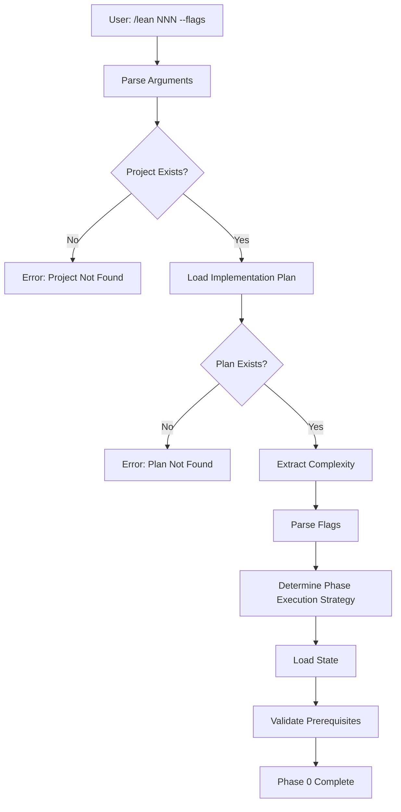
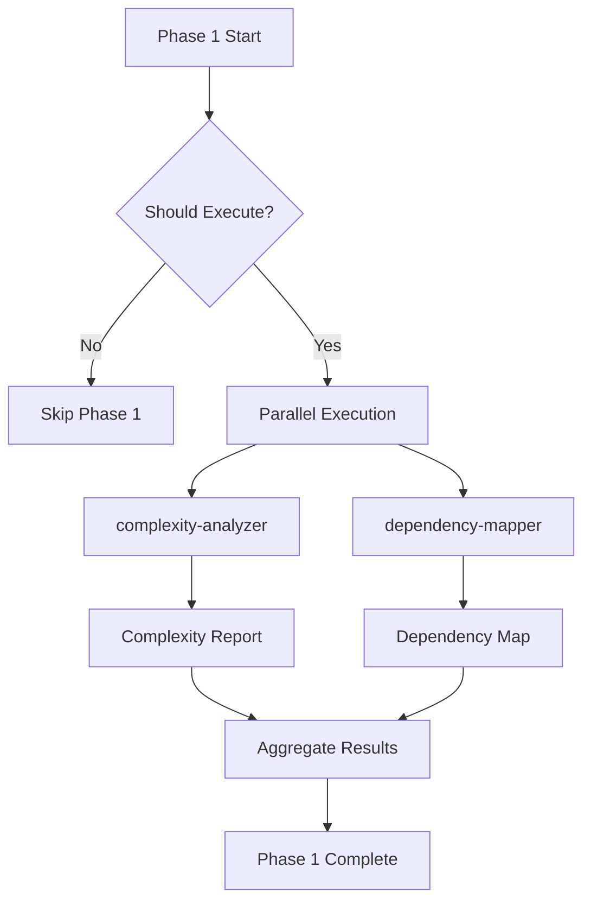
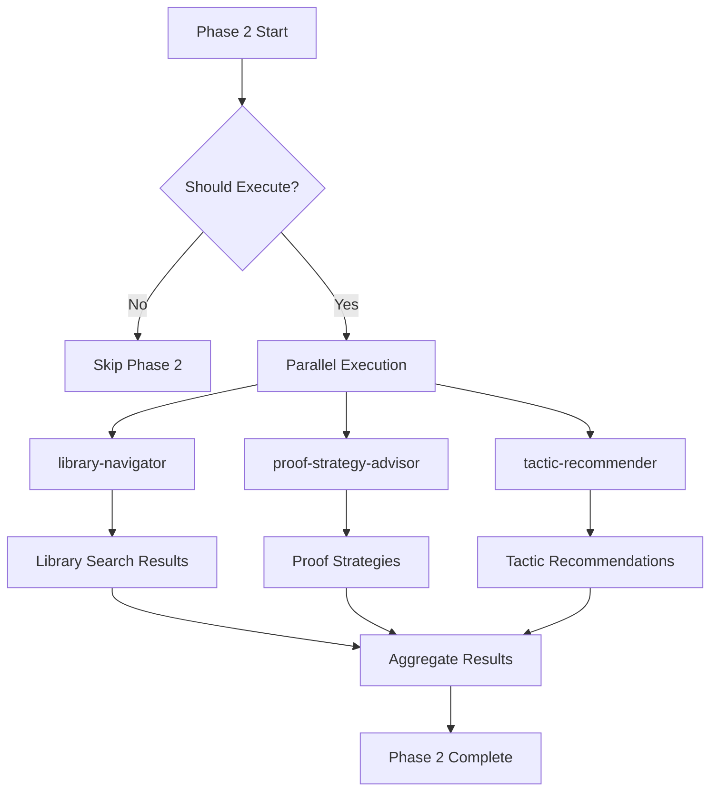
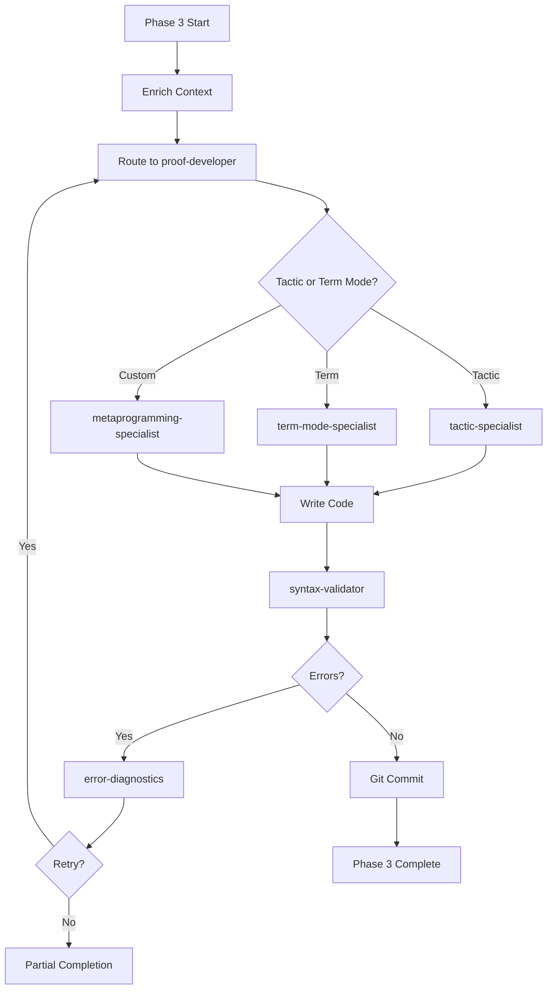
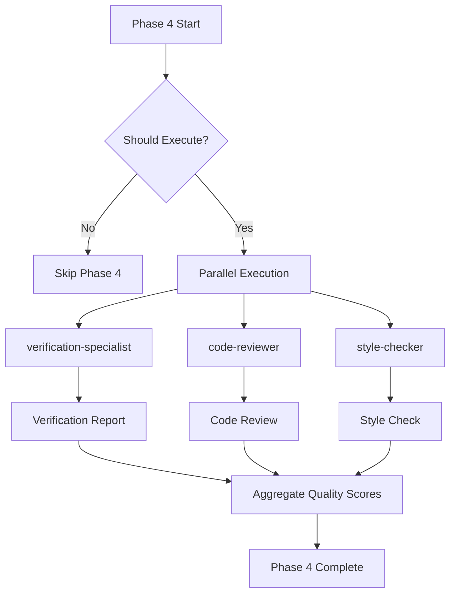
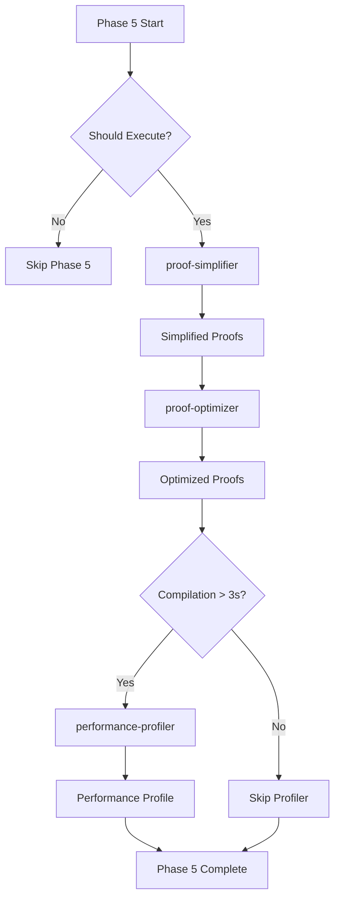
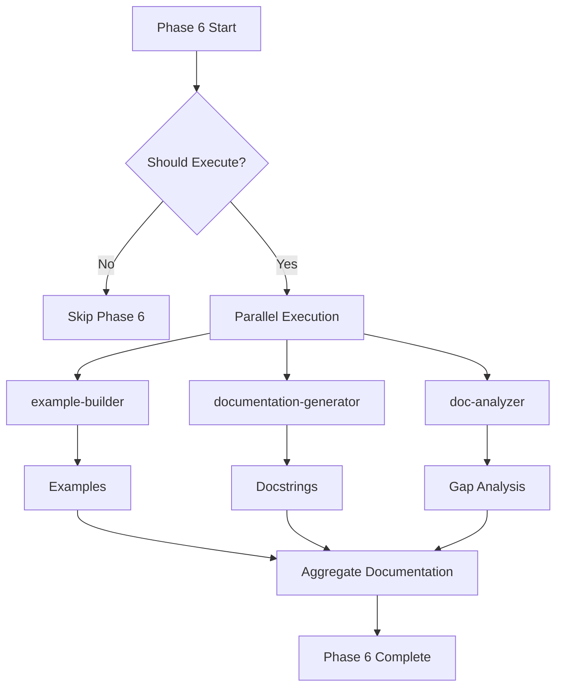
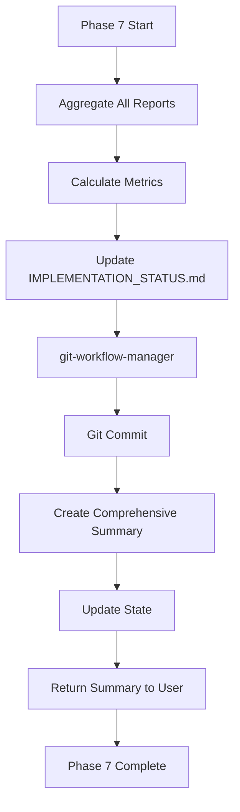

# Enhanced /lean Command - Architecture

**Version**: 1.0  
**Last Updated**: 2025-12-20  
**Status**: Production Ready

---

## Table of Contents

1. [System Overview](#system-overview)
2. [Phase Workflow](#phase-workflow)
3. [Specialist Routing Matrix](#specialist-routing-matrix)
4. [Artifact Management](#artifact-management)
5. [Data Flow](#data-flow)
6. [Execution Strategies](#execution-strategies)

---

## System Overview

### High-Level Architecture

```
┌─────────────────────────────────────────────────────────────────┐
│                    Enhanced /lean Command                        │
│                     (Orchestrator Agent)                         │
└─────────────────────────────────────────────────────────────────┘
                              │
                              ├─ Phase Controller
                              ├─ Specialist Router
                              ├─ Artifact Manager
                              ├─ State Tracker
                              └─ Error Handler
                              │
        ┌─────────────────────┼─────────────────────┐
        │                     │                     │
┌───────▼────────┐   ┌────────▼────────┐   ┌───────▼────────┐
│  Phase 0-2     │   │   Phase 3       │   │  Phase 4-7     │
│  (Analysis &   │   │ (Implementation)│   │  (Quality &    │
│   Research)    │   │                 │   │   Finalization)│
└───────┬────────┘   └────────┬────────┘   └───────┬────────┘
        │                     │                     │
        │                     │                     │
┌───────▼────────────────────▼─────────────────────▼────────┐
│              19 Specialist Subagents                       │
│  ┌──────────┐ ┌──────────┐ ┌──────────┐ ┌──────────┐     │
│  │complexity│ │ library  │ │  proof   │ │verification│   │
│  │ analyzer │ │navigator │ │developer │ │ specialist │   │
│  └──────────┘ └──────────┘ └──────────┘ └──────────┘     │
│       ... (15 more specialists) ...                        │
└────────────────────────────────────────────────────────────┘
                              │
        ┌─────────────────────┼─────────────────────┐
        │                     │                     │
┌───────▼────────┐   ┌────────▼────────┐   ┌───────▼────────┐
│   Artifacts    │   │   Git Commits   │   │  State Files   │
│  (Reports,     │   │                 │   │  (state.json)  │
│   Research,    │   │                 │   │                │
│   Examples)    │   │                 │   │                │
└────────────────┘   └─────────────────┘   └────────────────┘
```

### Core Components

#### 1. Orchestrator Agent (lean.md)

**Responsibilities**:
- Parse user input (project number, flags)
- Determine phase execution strategy
- Route to appropriate specialists
- Aggregate results
- Generate comprehensive summary

**Key Features**:
- Intelligent phase skipping based on complexity
- Parallel specialist execution where possible
- Error handling and retry logic
- State management and persistence

---

#### 2. Phase Controller

**Responsibilities**:
- Determine which phases to execute
- Apply skip logic based on:
  - Complexity level (from plan)
  - User flags (--fast, --skip-*, --full)
  - Default heuristics
- Track phase execution state
- Handle phase dependencies

**Skip Logic**:
```python
def should_execute_phase(phase_id, complexity, flags):
    if flags.full:
        return True  # --full overrides all skipping
    
    if flags.fast:
        return phase_id in [0, 3, 7]  # Only core phases
    
    if phase_id == 0 or phase_id == 3 or phase_id == 7:
        return True  # Core phases always execute
    
    if phase_id == 1:  # Pre-Planning
        return complexity == "complex" and not flags.skip_research
    
    if phase_id == 2:  # Research
        return complexity != "simple" and not flags.skip_research
    
    if phase_id == 4:  # Verification
        return complexity != "simple" and not flags.fast
    
    if phase_id == 5:  # Optimization
        return complexity != "simple" and not flags.skip_optimization
    
    if phase_id == 6:  # Documentation
        return complexity != "simple" and not flags.skip_docs
    
    return False
```

---

#### 3. Specialist Router

**Responsibilities**:
- Route requests to appropriate specialists
- Manage parallel vs. sequential execution
- Pass context and data to specialists
- Collect and aggregate specialist outputs
- Handle specialist failures

**Routing Strategies**:
- **Parallel**: Phases 1, 2, 4, 6 (independent specialists)
- **Sequential**: Phases 3, 5, 7 (dependent operations)
- **Conditional**: performance-profiler (only if compilation > 3s)

---

#### 4. Artifact Manager

**Responsibilities**:
- Create artifact directory structure
- Version artifacts (e.g., verification-001.md, verification-002.md)
- Write artifacts to appropriate locations
- Track artifact references
- Clean up old artifacts (optional)

**Directory Structure**:
```
.opencode/specs/NNN_project/
├── plans/
│   └── implementation-001.md
├── reports/
│   ├── complexity-001.md
│   ├── dependencies-001.md
│   ├── verification-001.md
│   ├── code-review-001.md
│   ├── style-check-001.md
│   ├── optimization-001.md
│   ├── performance-001.md (conditional)
│   └── documentation-001.md
├── research/
│   ├── library-search-001.md
│   ├── strategies-001.md
│   └── tactics-001.md
├── examples/
│   └── examples-001.md
├── summaries/
│   ├── implementation-summary.md
│   └── comprehensive-summary.md
└── state.json
```

---

#### 5. State Tracker

**Responsibilities**:
- Track execution state in state.json
- Record phase completion status
- Store metrics and timestamps
- Enable resumption after failures
- Provide execution history

**State Schema**:
```json
{
  "project_number": 123,
  "project_name": "project_name",
  "status": "completed|in_progress|failed",
  "complexity": "simple|moderate|complex",
  "started_at": "2025-12-20T10:00:00Z",
  "completed_at": "2025-12-20T10:18:00Z",
  "duration_seconds": 1080,
  "phases": {
    "0": {"status": "completed", "duration": 5},
    "1": {"status": "skipped", "reason": "complexity=moderate"},
    "2": {"status": "completed", "duration": 90},
    "3": {"status": "completed", "duration": 720},
    "4": {"status": "completed", "duration": 60},
    "5": {"status": "completed", "duration": 120},
    "6": {"status": "completed", "duration": 75},
    "7": {"status": "completed", "duration": 25}
  },
  "metrics": {
    "verification_score": 94.5,
    "code_review_score": 89.0,
    "style_compliance": 96.0,
    "optimization_reduction": 28,
    "documentation_coverage": 95.0
  },
  "artifacts": [
    ".opencode/specs/123_project/summaries/implementation-summary.md",
    ".opencode/specs/123_project/reports/verification-001.md",
    ...
  ],
  "git_commits": [
    {
      "hash": "abc123",
      "message": "feat(#123): Implement theorems"
    }
  ]
}
```

---

#### 6. Error Handler

**Responsibilities**:
- Catch and categorize errors
- Invoke error-diagnostics specialist
- Implement retry logic (max 3 attempts)
- Generate error reports
- Handle partial completion gracefully

**Error Categories**:
- **Validation Errors**: Project not found, invalid flags
- **Compilation Errors**: Type errors, syntax errors
- **Specialist Errors**: Specialist failure, timeout
- **Network Errors**: Loogle/LeanSearch unavailable
- **System Errors**: Out of memory, disk full

**Retry Strategy**:
```python
def handle_error(error, attempt):
    if attempt >= 3:
        return "fail"  # Max retries exceeded
    
    # Invoke error-diagnostics
    diagnosis = invoke_error_diagnostics(error)
    
    # Apply suggested fix
    apply_fix(diagnosis.suggested_fix)
    
    # Retry
    return "retry"
```

---

## Phase Workflow

### Phase 0: Input Validation & Configuration



**Inputs**: Project number, flags  
**Outputs**: Execution config, project context  
**Duration**: < 5 seconds  
**Skippable**: No

---

### Phase 1: Pre-Planning Analysis



**Inputs**: Implementation plan, codebase, domain context  
**Outputs**: Complexity assessment, dependency map  
**Duration**: 30-60 seconds  
**Skippable**: Yes (if complexity != "complex" or --skip-research)

---

### Phase 2: Research & Strategy



**Inputs**: Theorem statements, complexity assessment  
**Outputs**: Library search, strategies, tactic recommendations  
**Duration**: 60-120 seconds  
**Skippable**: Yes (if complexity = "simple" or --skip-research)

---

### Phase 3: Implementation



**Inputs**: Plan, enriched context from Phases 1-2  
**Outputs**: Implemented files, git commits  
**Duration**: 5-30 minutes  
**Skippable**: No (core functionality)

---

### Phase 4: Verification & Quality



**Inputs**: Implemented files, standards  
**Outputs**: Verification, code review, style reports  
**Duration**: 30-90 seconds  
**Skippable**: Yes (if complexity = "simple" or --fast)

---

### Phase 5: Optimization



**Inputs**: Implemented proofs  
**Outputs**: Simplified/optimized proofs, performance profile  
**Duration**: 60-180 seconds  
**Skippable**: Yes (if complexity = "simple" or --skip-optimization)

---

### Phase 6: Documentation



**Inputs**: Implemented files, documentation standards  
**Outputs**: Examples, docstrings, gap analysis  
**Duration**: 45-90 seconds  
**Skippable**: Yes (if complexity = "simple" or --skip-docs)

---

### Phase 7: Finalization



**Inputs**: All artifacts from Phases 1-6  
**Outputs**: Comprehensive summary, git commit, updated state  
**Duration**: 15-30 seconds  
**Skippable**: No (required for completion)

---

## Specialist Routing Matrix

### Complete Routing Table

| Phase | Specialist | Execution | Context | Input | Output | Skip Conditions |
|-------|-----------|-----------|---------|-------|--------|-----------------|
| **0** | *(none)* | - | - | Project #, flags | Execution config | Never |
| **1** | complexity-analyzer | Parallel | L2 | Task, codebase | Complexity report | --skip-research, simple |
| **1** | dependency-mapper | Parallel | L2 | Task, complexity | Dependency map | --skip-research, simple |
| **2** | library-navigator | Parallel | L2 | Theorems, keywords | Library search | --skip-research, --fast+simple |
| **2** | proof-strategy-advisor | Parallel | L2 | Theorems, similar | Strategies | --skip-research, --fast+simple |
| **2** | tactic-recommender | Parallel | L2 | Theorems, strategies | Tactic suggestions | --skip-research, --fast+simple |
| **3** | proof-developer | Sequential | L1 | Plan, enriched context | Implementation | Never |
| **3** | tactic-specialist | Sequential | L2 | Step, tactics, goal | Tactic proof | (via proof-developer) |
| **3** | term-mode-specialist | Sequential | L2 | Step, type, patterns | Term proof | (via proof-developer) |
| **3** | metaprogramming-specialist | Sequential | L2 | Step, requirements | Metaprog code | (via proof-developer) |
| **3** | syntax-validator | Real-time | L1 | File, code | Syntax errors | Never (automatic) |
| **3** | error-diagnostics | On-demand | L1 | Errors, context | Fix suggestions | (triggered by errors) |
| **4** | verification-specialist | Parallel | L2 | Files, standards | Verification report | --fast, simple |
| **4** | code-reviewer | Parallel | L2 | Files, standards | Code review | --fast, simple |
| **4** | style-checker | Parallel | L2 | Files, style guide | Style report | --fast, simple |
| **5** | proof-simplifier | Sequential | L2 | Proofs, patterns | Simplified proofs | --skip-optimization, --fast |
| **5** | proof-optimizer | Sequential | L2 | Proofs, patterns | Optimized proofs | --skip-optimization, --fast |
| **5** | performance-profiler | Conditional | L2 | Proofs, metrics | Performance profile | Compilation < 3s |
| **6** | example-builder | Parallel | L2 | Theorems, standards | Examples | --skip-docs, --fast |
| **6** | documentation-generator | Parallel | L2 | Files, standards | Docstrings | --skip-docs, --fast |
| **6** | doc-analyzer | Parallel | L2 | Files, standards | Gap analysis | --skip-docs, --fast |
| **7** | git-workflow-manager | Sequential | L2 | Files, metadata | Git commit | Never |

**Legend**:
- **L1**: Level 1 context (minimal)
- **L2**: Level 2 context (comprehensive)

---

## Artifact Management

### Artifact Types

| Type | Location | Versioned | Overwrite | Purpose |
|------|----------|-----------|-----------|---------|
| Implementation Plan | `plans/` | Yes | No | Input specification |
| Complexity Analysis | `reports/` | Yes | No | Complexity assessment |
| Dependency Map | `reports/` | Yes | No | Dependency graph |
| Library Search | `research/` | Yes | No | Similar theorems |
| Proof Strategies | `research/` | Yes | No | Strategy recommendations |
| Tactic Recommendations | `research/` | Yes | No | Tactic suggestions |
| Verification Report | `reports/` | Yes | No | Verification results |
| Code Review | `reports/` | Yes | No | Code quality assessment |
| Style Check | `reports/` | Yes | No | Style compliance |
| Simplification Report | `reports/` | Yes | No | Proof simplification |
| Optimization Report | `reports/` | Yes | No | Proof optimization |
| Performance Profile | `reports/` | Yes | No | Performance analysis |
| Documentation Analysis | `reports/` | Yes | No | Doc coverage |
| Examples | `examples/` | Yes | No | Working examples |
| Implementation Summary | `summaries/` | No | Yes | Implementation details |
| Comprehensive Summary | `summaries/` | No | Yes | Final summary |
| State | `.` | No | Yes | Execution state |

### Versioning Strategy

**Versioned Artifacts** (reports, research, examples):
- Format: `{type}-{version}.md`
- Version increments on each run
- Examples: `verification-001.md`, `verification-002.md`
- Preserves history for comparison

**Non-Versioned Artifacts** (summaries, state):
- Format: `{type}.md` or `state.json`
- Overwritten on each run
- Only latest version kept
- Reduces clutter

---

## Data Flow

### Context Enrichment Flow

```
Phase 0: Load Plan
    ↓
Phase 1: Analyze Complexity & Dependencies
    ↓ (enriched with complexity + dependencies)
Phase 2: Research Libraries & Strategies
    ↓ (enriched with similar theorems + strategies + tactics)
Phase 3: Implement with Enriched Context
    ↓ (enriched with implementation)
Phase 4: Verify Quality
    ↓ (enriched with quality scores)
Phase 5: Optimize
    ↓ (enriched with optimizations)
Phase 6: Document
    ↓ (enriched with documentation)
Phase 7: Finalize & Aggregate
```

### Data Passed Between Phases

| From Phase | To Phase | Data Passed |
|------------|----------|-------------|
| 0 | 1 | Plan, task description, codebase |
| 1 | 2 | Complexity level, dependencies |
| 2 | 3 | Similar theorems, strategies, tactics |
| 3 | 4 | Implemented files |
| 4 | 5 | Implemented files, quality scores |
| 5 | 6 | Optimized files |
| 6 | 7 | All artifacts |

---

## Execution Strategies

### Parallel Execution

**Phases with Parallel Execution**: 1, 2, 4, 6

**Benefits**:
- 50-66% speedup in those phases
- Better resource utilization
- Reduced total execution time

**Implementation**:
```python
# Pseudo-code for parallel execution
def execute_phase_parallel(specialists):
    futures = []
    for specialist in specialists:
        future = async_invoke(specialist, context)
        futures.append(future)
    
    results = await_all(futures)
    return aggregate(results)
```

**Maximum Concurrency**: 3 specialists (Phases 2, 4, 6)

---

### Sequential Execution

**Phases with Sequential Execution**: 3, 5, 7

**Reasons**:
- Dependencies between steps (Phase 3: implement → validate → commit)
- State modifications (Phase 5: simplify → optimize → verify)
- Aggregation required (Phase 7: collect → summarize → commit)

**Implementation**:
```python
# Pseudo-code for sequential execution
def execute_phase_sequential(specialists):
    results = []
    for specialist in specialists:
        result = invoke(specialist, context)
        context = enrich(context, result)
        results.append(result)
    
    return aggregate(results)
```

---

### Conditional Execution

**Conditional Specialists**:
- `performance-profiler` (Phase 5): Only if compilation time > 3s

**Benefits**:
- Avoid unnecessary work
- Optimize execution time
- Focus on actual bottlenecks

**Implementation**:
```python
# Pseudo-code for conditional execution
def execute_conditional(specialist, condition):
    if condition():
        return invoke(specialist, context)
    else:
        return skip(specialist, reason="condition not met")
```

---

## Summary

### Key Architectural Principles

1. **Modularity**: Each phase is independent and focused
2. **Composability**: Phases can be skipped or combined
3. **Parallelism**: Independent specialists execute in parallel
4. **Enrichment**: Context grows richer through phases
5. **Artifact-Centric**: All outputs are artifacts for audit trail
6. **State-Driven**: Execution state enables resumption
7. **Error-Resilient**: Automatic retry and graceful degradation

### Performance Characteristics

| Aspect | Metric |
|--------|--------|
| **Parallel Speedup** | 50-66% in parallel phases |
| **Phase Skipping** | 70% time reduction for simple proofs |
| **Caching** | 30-40% hit rate (planned) |
| **Total Speedup** | 70-85% vs. manual implementation |

### Scalability

- **Specialists**: Easily add new specialists to phases
- **Phases**: Can add new phases without breaking existing
- **Flags**: Can add new flags for fine-grained control
- **Artifacts**: Versioning supports unlimited runs

---

**For more information**:
- User Guide: `user-guide.md`
- Development Guide: `development.md`
- Implementation Plan: `../plans/implementation-plan-v1.md`
