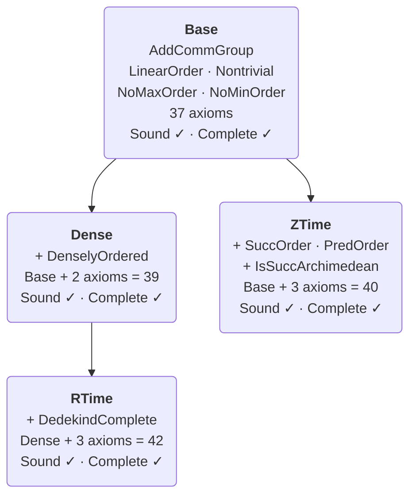

# A Bimodal Logic for Tense and Modality

[](https://github.com/benbrastmckie/BimodalLogic/actions/workflows/ci.yml)

This repository implements the **bimodal fragment** of the [Logos](https://logos-labs.ai/) in Lean 4, establishing soundness and completeness for a logic designed for reasoning about future contingency in non-deterministic dynamical systems. The **task semantics** evaluates formulas at both a world-history and time, where world-histories are functions from times to world-states constrained by the task relation which encodes the possible transitions between world-states over a duration of time.

Whereas dynamical systems theory provides mathematical resources for modeling the evolution of both deterministic and non-deterministic systems, a bimodal logic with tense and modal operators provides inferential resources for conducting verified reasoning about such systems. By encoding the constraints on possible transitions into the logical framework itself, one can draw fast and principled inferences about past and future contingency despite incomplete information.

The repository implements the syntax, task semantics, proof theory, and metalogic for the _Bimodal Logic of Tense and Modality_ (TM) which combines S5 modal operators with the Since/Until linear tense operators.

**Paper**: ["The Construction of Possible Worlds"](https://benbrastmckie.com/publications/possible_worlds.pdf) (Brast-McKie, forthcoming in JPL) — compositional semantics for bimodal logics grounded in non-deterministic dynamical systems

**Specification**: [BimodalReference.pdf](latex/BimodalReference.pdf) — complete axiom schemas and proof-theoretic documentation (outdated)

**Demo**: [BimodalProofs.lean](FormalSystem/Examples/BimodalProofs.lean) — sorry-free demonstration proofs

<!-- BEGIN GENERATED: inventory dir=FormalSystem rows=totals desc=no -->
| Metric | Count |
|--------|-------|
| Live `.lean` files | 459 |
| Live lines | 281,440 |
| Archived `.lean` files | 164 |
| Archived lines | 90,890 |
<!-- END GENERATED -->

The table above is generated: `bash scripts/check-module-invariants.sh --emit-inventory`
rewrites it from the tree, and the `INV` check in the same script fails if it has drifted. Do
not edit the numbers by hand.

---

## Operators

The logic uses 5 primitive connectives. All other operators are derived.

### Primitive

| Symbol | Lean Constructor | Reading |
|--------|-----------------|---------|
| `⊥` | `bot` | falsum |
| `φ → ψ` | `imp φ ψ` | material conditional |
| `□φ` | `box φ` | necessity ("necessarily φ") |
| `U(φ,ψ)` | `untl ψ φ` | "ψ until φ" |
| `S(φ,ψ)` | `snce ψ φ` | "ψ since φ" |

**Argument order — the two notations are mirror images.** This table's `U(·,·)` / `S(·,·)` is
**event-first**: in `U(φ,ψ)`, `φ` is the event at the witness time and `ψ` is the guard that holds
across the intervening interval (see the truth clauses under "Task Semantics" below). Lean's
`untl` / `snce` constructors are **guard-first** (`untl guard event`), matching the paper's infix
`φ \until ψ`. That is why the Lean Constructor column reads `untl ψ φ` rather than `untl φ ψ`.
A reader cross-referencing this README against the paper, or against
`FormalSystem/Syntax/Formula.lean`, must swap the arguments or every temporal clause inverts.


### Derived

| Symbol | Definition | Reading |
|--------|-----------|---------|
| `¬φ` | `φ → ⊥` | negation |
| `φ ∧ ψ` | `¬(φ → ¬ψ)` | conjunction |
| `φ ∨ ψ` | `¬φ → ψ` | disjunction |
| `◇φ` | `¬□¬φ` | possibility |
| `Fφ` | `U(φ, ¬⊥)` | "eventually φ" |
| `Pφ` | `S(φ, ¬⊥)` | "previously φ" |
| `Gφ` | `¬F¬φ` | "it is always going to be φ" |
| `Hφ` | `¬P¬φ` | "it always has been φ" |
| `△φ` | `Hφ ∧ φ ∧ Gφ` | "always φ" |
| `▽φ` | `¬△¬φ` | "sometimes φ" |
| `Xφ` | `U(φ, ⊥)` | "at the next moment φ" |
| `Yφ` | `S(φ, ⊥)` | "at the previous moment φ" |

---

## Task Semantics

A **task frame** `F = (W, D, R)` consists of a **nonempty** set `W` of world-states, a totally ordered commutative group `D` of durations, and a **task relation** `R : W → D → W → Prop`. The relation is primitive on the non-negative durations and extended to negative ones by the *converse convention* `w ⇒_{-x} u := u ⇒_x w` for `x ≥ 0`. On top of that it satisfies four axioms:

- ***Compositionality*** — `w ⇒_{x+y} v` **if and only if** `w ⇒_x u` and `u ⇒_y v` for some `u ∈ W`. Both directions are load bearing: the `←` half composes, the `→` half interpolates.
- ***Seriality*** — for every `w` and every `x ≥ 0` there are `u, v ∈ W` with `w ⇒_x u` and `v ⇒_x w`.
- ***Limit*** — `⋂_{x > 0} (w)_x = {w}`, where `(w)_x` is the cone of states reachable from `w` within duration `x`.
- ***Saturation*** — `⋂ 𝒮 ≠ ∅` for every `⊇`-directed family `𝒮` of nonempty fibers and segments. In ball-space terms this is the condition `S₁ᵈ`, which is *strictly stronger* than "spherically complete" (`S₁`).

Nullity (`w ⇒_0 w`) is **not** an axiom: it is derived, choice-free, from *Seriality* at `x = 0` together with *Limit*. In Lean, `structure FrameOver` (`FormalSystem/Semantics/TaskFrame.lean`) — the fibre over a temporal order, of which `TaskFrame` is the total space — additionally carries `converse` and `nullity_identity` as fields. Neither adds content — `converse` packages the converse convention, which a two-sided Lean relation cannot express in its type, and `nullity_identity` is derivable from `serial` and `limit`. Both are retained for construction ergonomics, so the Lean frame class is extensionally exactly the paper's.

A **world-history** `τ` in a task frame `F` is a function `τ : X → W` from a convex subset `X ⊆ D` to world states that respects the task relation: for all times `x, y ∈ X` with `x ≤ y`, we have `τ(x) ⇒_{y-x} τ(y)`.

A **task model** `M = (F, I)` extends a task frame `F` with an interpretation function `I : W → Atom → Prop` that assigns truth values to sentence letters `Atom := {p_i : i ∈ ℕ}` at each world state. Truth is evaluated relative to a model `M`, a world-history `τ`, and a time `x`:

- `M, τ, x ⊨ p_i` iff `x ∈ dom(τ)` and `I(τ(x), p_i)`
- `M, τ, x ⊨ ⊥` never
- `M, τ, x ⊨ φ → ψ` iff `M, τ, x ⊭ φ` or `M, τ, x ⊨ ψ`
- `M, τ, x ⊨ □φ` iff `M, σ, x ⊨ φ` for all **total** world-histories `σ` (those with `dom(σ) = D`; the paper's `H_F`)
- `M, τ, x ⊨ U(φ,ψ)` iff there exists `y > x` with `M, τ, y ⊨ φ` and `M, τ, z ⊨ ψ` for all `z` with `x < z < y`
- `M, τ, x ⊨ S(φ,ψ)` iff there exists `y < x` with `M, τ, y ⊨ φ` and `M, τ, z ⊨ ψ` for all `z` with `y < z < x`

Relative to a world-history, any duration `x` may be referred to as the *time* after `x` duration from the origin (the additive unit `0` in `D`) in that world-history.

The task semantics is developed in ["The Construction of Possible Worlds"](https://benbrastmckie.com/publications/possible_worlds.pdf) (Brast-McKie, 2025), providing resources for modeling non-deterministic dynamical systems.

---

## Project Structure

```
.                                 # repository root
├── lakefile.lean                 # two libraries: FormalSystem (default target), BimodalTest
├── FormalSystem.lean             # Lake root module for the FormalSystem library
├── FormalSystem/                 # TM bimodal logic library (live file and line counts: see the table above)
│   ├── FormalSystem.lean         # library aggregator
│   ├── BaseLanguage/             # shared base-language definitions
│   ├── StarLanguage/             # L⋆ = L⁺ plus the stability modal ⊡, and its logic TM⋆
│   ├── Syntax/                   # Formula types, atoms, contexts
│   ├── ProofSystem/              # Axioms (45 constructors, nine layers), derivation trees
│   ├── Semantics/                # TemporalOrder, FrameOver, TaskFrame, WorldHistory, TaskModel, validity
│   ├── Metalogic/                # Soundness, completeness, decidability
│   │   ├── Core/                 # MCS theory, deduction theorem
│   │   ├── Bundle/               # BFMCS construction
│   │   ├── BXCanonical/          # BX chronicle construction — the wired completeness entry point
│   │   ├── WeakCanonical/        # Reynolds/Doets pipeline — the largest subtree
│   │   ├── Algebraic/            # Boolean/ultrafilter infrastructure (FlowFrame, Lindenbaum quotient)
│   │   ├── Decidability/         # Tableau procedure with proof extraction
│   │   ├── Independence/         # axiom-independence results
│   │   └── SoundnessLemmas/      # per-axiom soundness lemmas
│   ├── Theorems/                 # Derived theorems (perpetuity, combinators, propositional)
│   ├── Automation/               # Proof search tactics & training data pipeline
│   ├── Examples/                 # Pedagogical examples
│   └── Boneyard/                 # ARCHIVE — the single archive, excluded from every live count
├── Tests/BimodalTest/            # Test suite (the BimodalTest library)
├── scripts/                      # Repository invariant checks and tooling
└── docs/                         # Repository documentation
```

`Metalogic/WeakCanonical/` is the largest subtree. Besides the Reynolds/Doets discrete pipeline
it carries the Dedekind/real route — `DenseModelSurgery/` and `RealModel/` — and `GroupModel/`,
which hosts the discharged `countermodel_discrete` at the non-Archimedean discrete carrier
`ℚ ×ₗ ℤ`. `Kamp/` is the Kamp-style expressiveness development; its headline theorem,
`kampPriorExpressiveCompleteness` (expressive completeness of `{U, S}` for Prior structures), is
discharged sorry-free — see "Characterization and Definability" below.

---

## Installation

**Requirements**: Lean 4 v4.33.0-rc1 and Lake (included with Lean).

```bash
# Install elan (Lean version manager)
curl https://raw.githubusercontent.com/leanprover/elan/master/elan-init.sh -sSf | sh

# Clone and build (first build downloads Mathlib cache, ~30 minutes)
git clone https://github.com/benbrastmckie/BimodalLogic.git
cd BimodalLogic
lake build
```

For detailed setup instructions, see [Installation Guide](docs/installation/BASIC_INSTALLATION.md).

---

## Metalogical Results

The metalogic is organized around a base axiom system with three extensions: Dense, ZTime, and RTime. Every flagship soundness and completeness result below is `SORRY-FREE (sorryAx-free; axioms: exactly propext, Classical.choice, Quot.sound)`. Weak completeness and finite-context consequence completeness are proven for **all four** frame classes — Base, Dense, ZTime, and RTime.

**Strong completeness** is a separate matter. The repository reserves the term for consequence from a possibly-infinite premise set `Γ : Set Formula`; the results above are *finite*-context (`Context` is `List Formula`, so every context here is finite, and each such result is inter-derivable with the corresponding weak form through the deduction theorem). The infinitary statement has three distinct statuses across the four classes, which must not be collapsed into one:

- **ZTime** — **refuted**. `notStrongCompletenessZTime` and its companion `notCompactZTime` (`Metalogic/DiscreteNonCompactness.lean`) settle it negatively.
- **Base** and **Dense** — **proved**. `strongCompletenessBase` and `strongCompletenessDense` (`Metalogic/Compactness.lean`) inhabit the `StrongCompletenessBase`/`StrongCompletenessDense` statements of `Metalogic/SetConsequence.lean`, via `compactBase`/`compactDense` and the corresponding model-existence theorems, proved by an ultraproduct over the finite sublists of the premise set.
- **RTime** — **refuted**, like ZTime. `notStrongCompletenessRTime` and its companion `notCompactRTime` (`Metalogic/DedekindNonCompactness.lean`) settle it negatively; `StrongCompletenessRTime` and `CompactRTime` are stated in `Metalogic/SetConsequence.lean` so the refutations have something to name, and both docstrings there already record that the statements are false. Reynolds 1992 Theorem 7 is weak-only, and the refutation is why: it does not contradict Reynolds, it explains why only weak completeness is available for this class.

Soundness and completeness for the RTime class are both stated against `ValidRTime`, the dense-and-complete predicate, not the density-free `ValidComplete`: `density` and `dense_indicator` are admissible in a RTime derivation and both are false on ℤ (`FormalSystem/ProofSystem/Axioms.lean`).



### Axiom Systems

| System | Axioms | Additional Axioms | Standard Model | Soundness | Completeness |
|--------|--------|-------------------|----------------|-----------|--------------|
| **Base** | 37 | seriality built in (`⊤ → F⊤`, `⊤ → P⊤`) | — | `soundness` | `completeness` |
| **ZTime** | 40 | `Fφ → U(φ,¬φ)`, `Pφ → S(φ,¬φ)`, `G(Gφ→φ) → (FGφ→Gφ)` | ℤ | `soundness_ztime` | `completeness_ztime` |
| **Dense** | 39 | `GGφ → Gφ` (`density`), `¬U(⊤,⊥)` (`dense_indicator`) | ℚ | `soundness_dense` | `completeness_dense` |
| **RTime** | 42 | the two Dense axioms plus Reynolds' `prior_U_gap`, `prior_S_gap`, `sep` | ℝ | `soundness_rtime` | `completeness_rtime` |

`inductive Axiom` has **45 constructors in nine layers** (`FormalSystem/ProofSystem/Axioms.lean`). The 37 Base constructors are propositional (4), S5 modal (5), Burgess-Xu temporal (18), an additional Burgess-Xu temporal layer (4), modal-temporal interaction (1), and uniformity (5). The remaining eight are the class-specific extensions: density (2), Prior-UZ/SZ (2) and Z1 (1) for the ZTime class, and Reynolds' Dedekind axioms (3).

The Dense and ZTime logics are independent extensions — neither subsumes the other. RTime extends **Dense**: `Axiom.minFrameClass` places `density` and `dense_indicator` below `FrameClass.RTime`, because Reynolds' own axiomatization of real flow contains them. ZTime and RTime are likewise incomparable, and `RTime ≰ Dense`.

**`FrameClass.RTime` is the paper's TM⁺_c.** Under the paper's current text, `cor:tm-completeness` reads "TM⁺_c — Weakly complete over the dense-and-complete class", which is exactly what `FrameClass.RTime` denotes: `DenselyOrdered D` plus Dedekind completeness. Earlier revisions of this README described TM⁺_c as completeness *simpliciter* with models `{ℤ, ℝ}` and theory `Th(ℤ) ∩ Th(ℝ)`, and concluded that no element of `FrameClass` picks the class out. That is stale on both counts: the `{ℤ, ℝ}` / `Th(ℤ) ∩ Th(ℝ)` footnote is commented out in the live `def:TMplus-c`, and the class the paper now names for TM⁺_c is dense-and-complete, not complete-simpliciter. There is no gap.

One question does remain open, and it is the paper's, not the tree's: `def:TMplus-c` bases BX_c on `TMP-PU` and `TMP-SEP` with **no density axiom**, whereas `FrameClass.RTime` admits `density` and `dense_indicator` alongside Reynolds' triple. Either the paper's BX_c should carry the density axioms, or this tree should record that `completeness_rtime` proves a stronger-premise statement than the paper's corollary. That is an author decision and is not made here.

### The base language L and the stability extension L⋆

Two further object languages sit beside L⁺ (`Formula`): the tense-primitive **base language L**
(`FormalSystem/BaseLanguage/`, `BLFormula`, related to L⁺ by the translation `tr`) and the
**stability extension L⋆** (`FormalSystem/StarLanguage/`, `StarFormula` = L⁺ plus the stability
modal `⊡`, related to L⁺ by the embedding `ofFormula`). Every result below is sorry-free
(axioms: exactly `propext`, `Classical.choice`, `Quot.sound`) and holds at all four frame classes
unless a class is named.

Per-theorem status — every statement, its Lean name, its frame class and its machine-pinned
axiom set — is in [`docs/theorem-index.md`](docs/theorem-index.md), the repository's single
ledger. The five rows below are a highlights table, not a second copy of it.

| Result | L (TM, via `tr`) | L⋆ (TM⋆, via `ofFormula`) |
|--------|------------------|----------------------------|
| Semantic conservativity over/under L⁺ | `blValidIn_iff_validIn_tr` | `starValidIn_ofFormula_iff` |
| Soundness | `bl_soundness_*` (TM) | `star_soundness_validIn` (TM⋆), TD discharged semantically |
| Proof-theoretic conservativity, backward | `derivable_translate` (TM ⊆ TM⁺) | `starDerivable_of_derivable` (TM⁺ ⊆ TM⋆) |
| Proof-theoretic conservativity, forward | **refuted** at Base/ZTime, open at Dense/RTime (`tmComplete_iff_forward`, `tmCompleteZTime_refuted`) | **proved**: `starDerivable_ofFormula_iff`, from TM⋆ soundness and the four completeness engines |
| Completeness and compactness | of the **H/G-fragment** `TMFrag fc φ := TM⁺ ⊢[fc] tr φ` (`tmFrag_iff_blValidIn`), whose consequence relation is compact at Base and Dense (`blCompactBase`, `blCompactDense`); TM itself is incomplete, and `TM ⊊ TMFrag` at ZTime (`tm_lt_tmFrag_ztime`) | **open**; compactness not attempted (see below) |

The L side lives in `Metalogic/Conservativity/{Fragment,FragmentCompactness}.lean`; the L⋆ side
in `Semantics/Star*.lean` and `Metalogic/Conservativity/Star/`. TM⋆'s axioms are the 45 TM⁺
schemata re-declared over `StarFormula` (so that, e.g., `□⊡p → □G⊡p` is an MF instance) plus S5
for `⊡`, `□φ → ⊡φ`, `p → ⊡p` for atoms, and two **pasting** schemata with pure-future/pure-past
side conditions (`Semantics/StarPasting.lean`); the five refutations in
`Semantics/StarNonValidities.lean` bound the set from above.

**Open problems for TM⋆.**

- **Completeness** of TM⋆ over the paper's all-histories semantics, at any class. The nearest
  results in the literature are for Ockhamist branching time: Reynolds 2003 axiomatizes the
  complete-tree Ockhamist logic (F/P only, with an IRR-style rule and a long construction), and
  Zanardo 1991 axiomatizes the *bundled* Since/Until Ockhamist semantics with Burgess-Gabbay-style
  rules. Neither transfers directly: every completeness engine in this tree builds a
  deterministic countermodel, on which `⊡` is the identity. Nothing here asserts or approaches
  TM⋆ completeness.
- **Decidability** of TM⋆. By the conservativity above it is no easier than decidability of
  TM⁺, itself open for every class (next subsection); no result in either direction is claimed.

### Decidability

`FormalSystem/Metalogic/Decidability/` implements a tableau decision procedure with proof
extraction. Its status is **one-directional**, and must be described that way; the reason is
recorded in [ADR-007](docs/architecture/ADR-007-Decidability-One-Directional.md).

- **Landed.** The sound direction of the `isValid`-shaped statement, `isValid φ fc = true → ⊨ φ`:
  `sound_of_isValid` and its corollary `isValid_sound` (`Decidability/Correctness.lean`),
  sorry-free, together with the `isTautology` / `isContradiction` / `isSatisfiable` siblings and
  the frame-class-relativized forms. `decide_sound` (same file) is the corresponding corollary at
  the empty context. On the tableau side, `ruleSound_of_mem_allRulesForFC`
  (`Decidability/Verified/Decidable.lean`) is the rule half of `allClosed → valid`.
- **Open.** The completeness direction, `⊨ φ → isValid φ fc = true`, and therefore
  `valid_iff_allClosed`, the `isValid φ fc = true ↔ ⊨ φ` biconditional, and the `Decidable (⊨ φ)`
  instances for the four frame classes. No `isValid`-shaped biconditional is written before it
  can be proved.
- **Partial.** Proof extraction: `extractProof` (`Decidability/ProofExtraction.lean`) runs five
  strategies in order and returns `.incomplete` once all are exhausted.

### Characterization and Definability

`FormalSystem/Semantics/Correspondence/` (the `Th`/`Mod` Galois connection between sets of task
frames and sets of formulas) and `FormalSystem/Metalogic/WeakCanonical/Kamp/` (expressive
completeness) each contribute a **sorry-free** result family that does not fit the soundness/
completeness table above.

**Galois-closure and definability.** `galoisClosed_mod` is the organizing equivalence: a frame
class is axiomatizable — the model class of some formula set — exactly when it is Galois-closed
under `Th`/`Mod` (`Semantics/Correspondence/Galois.lean`). `galoisClosed_of_indicator` is the
single mechanism by which closure is shown: exhibit one formula valid on precisely the class's
members. Two positive results apply it: `galoisClosed_sat_dense` (`Sat .Dense` is Galois-closed)
and `galoisClosed_isDiscrete` (`{F | F.IsDiscrete}`, the bare structural clause of
`def:frame-properties` — **not** the narrower Hölder-to-ℤ class `FrameClass.Sat FrameClass.ZTime`
— is Galois-closed), both via the indicator biconditionals `validOn_nextTop_iff` /
`validOn_nextTop_iff_isDiscrete` (`Semantics/Correspondence/Indicator.lean`). Two negative results
sandwich the corresponding narrowed classes instead: `sat_rtime_ssubset_mod_axiomSet` proves
that `Sat .RTime` is **not Galois-closed** — a statement about definability of the model
class, a different property from RTime strong completeness, which is machine-refuted and on
which this result does not bear either way — and
`sat_ztime_ssubset_mod_axiomSet` proves the analogous fact for `Sat .ZTime`
(`Metalogic/Independence/RationalWitness.lean` and `Metalogic/Independence/LexIntWitness.lean`,
respectively). Closed-form characterizations of `Mod (AxiomSet .ZTime)` and
`Mod (AxiomSet .RTime)` remain open and are not promised.

**Expressive completeness (Kamp, Prior structures).** `kampPriorExpressiveCompleteness`
(`Metalogic/WeakCanonical/Kamp/KampPrior.lean`) is sorry-free (axioms: exactly `propext`,
`Classical.choice`, `Quot.sound`) and shows that `{U, S}` is expressively complete relative to
monadic first-order logic **for Prior structures** — not for TM, and not for all task frames.
It is load-bearing for the live completeness chain via `uSExpressivelyCompleteOverPrior`.

---

## Documentation

### Reference

- [Axiom Reference](docs/reference/axiom-reference.md) — complete axiom schemas for all 45 constructors
- [Operator Reference](docs/reference/operators.md) — formal operator definitions
- [Tactic Reference](docs/reference/tactic-reference.md) — custom proof tactics
- [Specification Document](latex/BimodalReference.pdf) — full formal specification

### User Guides

- [Tutorial](docs/user-guide/tutorial.md) — introduction to writing bimodal proofs
- [Contributing](docs/development/CONTRIBUTING.md) — contribution guidelines

### Research

- [Bimodal Logic](docs/research/BIMODAL_LOGIC.md) — theoretical foundations and Logos connection
- [Metalogic README](FormalSystem/Metalogic/README.md) — architecture of the completeness proof

---

## Related Projects

- **[BimodalHarness](https://github.com/benbrastmckie/BimodalHarness)** — Training harness for neural proof search. Consumes the training datasets generated by this repo's [data pipeline](docs/training/PIPELINE.md) to train value networks, policy networks, and run MCTS proof search over TM derivations.
- **[ModelChecker](https://github.com/benbrastmckie/ModelChecker)** — Python/Z3 countermodel generation for Logos semantics. Together with ProofChecker, this forms the dual verification architecture: ModelChecker searches for countermodels while ProofChecker constructs formal derivations.
- **[Logos Laboratories](https://logos-labs.ai/)** — the broader Logos project of which this bimodal logic is a fragment.

---

## Verifying the main theorems

Every headline result in this repository is machine-checked, and you can check that claim
yourself rather than take it. Two commands do it.

**One: read the axiom sets out of the built library.** Write this to a scratch file and run it
with `lake env lean`:

```lean
import FormalSystem

#print axioms FormalSystem.Metalogic.soundness
#print axioms FormalSystem.Metalogic.BXCanonical.completeness
#print axioms FormalSystem.Metalogic.strongCompletenessBase
#print axioms FormalSystem.Metalogic.notStrongCompletenessZTime
#print axioms FormalSystem.Metalogic.Decidability.sound_of_isValid
```

All five print the same record:

```
'FormalSystem.Metalogic.soundness' depends on axioms: [propext, Classical.choice, Quot.sound]
```

Those three are Lean's standard classical axioms. The absence of `sorryAx` is the point: a
`sorry` anywhere on a proof's dependency graph would appear in this list. The five above are a
representative slice — soundness, weak completeness, strong completeness, a machine-checked
*refutation*, and the sound half of decidability — not the whole set.

**Two: run the invariant harness.** It checks the axiom sets of **105** pinned declarations, not
five, along with the build, the structural-`sorry` inventory, every import, every module path
cited in markdown, every paper anchor, and the generated inventory tables:

```bash
bash scripts/check-module-invariants.sh              # everything, including the build
bash scripts/check-module-invariants.sh --no-build   # structural checks only, seconds not minutes
```

A change to any pinned axiom set is a hard stop, not a new baseline: it means a proof was
silently rerouted through different dependencies, which is detectable even when the build stays
green and the sorry count is unchanged.

Per-theorem status — statement, Lean name, file, frame class and pinned axiom set — is in
[`docs/theorem-index.md`](docs/theorem-index.md), the single ledger.

---

## Citation

If you use this project in your research, please cite:

```bibtex
@article{brastmckie2025construction,
  title     = {The Construction of Possible Worlds},
  author    = {Brast-McKie, Benjamin},
  journal   = {Journal of Philosophical Logic},
  publisher = {Springer},
  year      = {2026},
  note      = {Forthcoming},
  url       = {https://benbrastmckie.com/publications/possible_worlds.pdf}
}

@software{brastmckie2026bimodallogic,
  title     = {BimodalLogic: A Lean 4 Formalization of the Bimodal Logic TM},
  author    = {Brast-McKie, Benjamin},
  year      = {2026},
  url       = {https://github.com/benbrastmckie/BimodalLogic}
}
```

A [`CITATION.cff`](CITATION.cff) is provided for citation managers, and
[`references.bib`](references.bib) collects the works this development formalizes, transcribes
or cites by name.

**Key references**:

- Burgess, J. P. (1982). Axioms for tense logic. I. "Since" and "Until." *Notre Dame Journal of Formal Logic*, 23(4), 367–374.
- Xu, M. (1988). On some U,S-tense logics. *Journal of Philosophical Logic*, 17(2), 181–202.
- Reynolds, M. (1994). Axiomatising U and S over integer time. *Advances in Modal Logic*.
- Venema, Y. (1993). Since and Until. *Advances in Modal Logic*.
- Doets, K. (1987). *Completeness and Definability: Applications of the Ehrenfeucht Game in Second-Order and Intensional Logic*.
- Gabbay, D., Hodkinson, I., & Reynolds, M. (1994). *Temporal Logic: Mathematical Foundations and Computational Aspects*, Vol. 1.
- Blackburn, P., de Rijke, M., & Venema, Y. (2002). *Modal Logic*. Cambridge University Press.

---

## License

This project is licensed under Apache-2.0. See [LICENSE](LICENSE) for details.

## Tags

bimodal-logic · TM-plus · soundness · completeness · compactness · decidability · lean4
