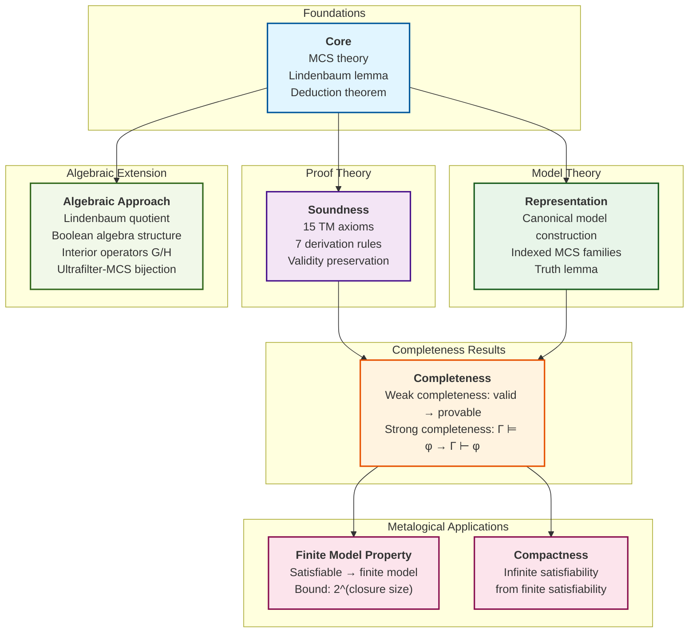

# TM Bimodal Logic Metalogic

This directory contains the complete metalogic infrastructure for TM bimodal logic, including soundness, completeness, the finite model property, and compactness.

## What the Metalogic Establishes

The metalogic proves the fundamental metatheoretic results for TM bimodal logic:

1. **Soundness**: Every derivable formula is semantically valid
2. **Representation**: Consistent formulas have canonical models
3. **Completeness**: Every valid formula is derivable (uses Representation)
4. **Finite Model Property**: Satisfiable formulas have finite models
5. **Compactness**: Infinite satisfiability reduces to finite satisfiability

## Main Results

### Soundness (`Soundness/`)
```lean
theorem soundness : (Gamma ⊢ φ) → (Gamma ⊨ φ)
```
All 15 TM axioms and 7 derivation rules preserve validity.

### Representation (`Representation/`)
```lean
theorem representation_theorem : SetConsistent {φ} → satisfiable_in_canonical_model φ
```
Consistent formulas are satisfiable in the universal canonical model.

### Weak Completeness (`Completeness/`)
```lean
theorem weak_completeness : valid φ → ContextDerivable [] φ
theorem provable_iff_valid : ContextDerivable [] φ ↔ valid φ
```
(Depends on Representation for canonical model construction.)

### Finite Model Property (`FMP/`)
```lean
theorem finite_model_property : satisfiable φ → ∃ finite_model, satisfiable_in φ
theorem semanticWorldState_card_bound : card worlds ≤ 2^closureSize
```

### Compactness (`Compactness/`)
```lean
theorem compactness : (∀ finite Delta ⊆ Gamma, satisfiable Delta) → satisfiable Gamma
```

## Architecture Overview

```
Metalogic/
├── Core/              # Foundational definitions and MCS theory
│   ├── MaximalConsistent.lean   # Complete MCS theory (sorry-free)
│   ├── DeductionTheorem.lean    # Deduction theorem (sorry-free)
│   └── MCSProperties.lean       # MCS lemmas (sorry-free)
│
├── Soundness/         # Soundness theorem (NEW - migrated 2026-01-29)
│   ├── Soundness.lean           # Main theorem + 15 axiom validity
│   └── SoundnessLemmas.lean     # Temporal duality bridge
│
├── Representation/    # Canonical model construction
│   ├── IndexedMCSFamily.lean    # MCS family structure
│   ├── CoherentConstruction.lean # Coherent family builder
│   ├── TruthLemma.lean          # MCS ↔ truth correspondence
│   └── UniversalCanonicalModel.lean  # Representation theorem
│
├── FMP/               # Finite Model Property (parametric)
│   ├── Closure.lean             # Subformula closure
│   ├── SemanticCanonicalModel.lean  # Finite model construction
│   └── FiniteModelProperty.lean # FMP theorem
│
├── Completeness/      # Weak and strong completeness
│   ├── WeakCompleteness.lean    # valid → provable (sorry-free)
│   └── ...StrongCompleteness.lean  # Context-based versions
│
├── Compactness/       # Compactness theorem
│   └── Compactness.lean         # (sorry-free)
│
└── Algebraic/         # Alternative algebraic approach (sorry-free)
    ├── LindenbaumQuotient.lean     # Quotient construction via provable equivalence
    ├── BooleanStructure.lean       # Boolean algebra instance for quotient
    ├── InteriorOperators.lean      # G/H as interior operators
    ├── UltrafilterMCS.lean         # Bijection: ultrafilters <-> MCS
    └── AlgebraicRepresentation.lean # Main representation theorem
```

## Dependency Layers

```
Layer 1 (Foundations):
    Core/
      │
Layer 2 (Proof Theory):
    Soundness/
      │
Layer 3 (Model Theory):
    Representation/
      │
Layer 4 (Completeness):
    Completeness/
      │
Layer 5 (Applications):
    FMP/ ── Compactness/
      │
Layer 6 (Extensions):
    Algebraic/
```

### Dependency Flowchart (GitHub Rendering)



## Subdirectory Summaries

| Directory | Purpose | Status |
|-----------|---------|--------|
| `Core/` | MCS theory, Lindenbaum's lemma, deduction theorem | **Sorry-free** |
| `Soundness/` | Soundness theorem (15 axioms, 7 rules) | **Sorry-free** |
| `Representation/` | Canonical model via indexed MCS families | Core proven |
| `Completeness/` | Weak/strong completeness hierarchy | **Sorry-free** |
| `FMP/` | Finite model property with 2^n bound | Architectural sorries |
| `Compactness/` | Compactness theorem | **Sorry-free** |
| `Algebraic/` | Alternative algebraic approach | **Sorry-free** (complete) |

## Known Architectural Limitations

These are **final limitations** (not future work):

| Location | Limitation | Reason |
|----------|------------|--------|
| `SemanticCanonicalFrame.compositionality` | Sorry | Mathematically false for unbounded durations |
| `truth_at_implies_semantic_truth` | Sorry | Box quantifies over ALL histories (Task 750) |
| `Representation/TruthLemma.lean` box case | Sorry | Same Box semantics limitation |

**Resolution**: Use `semantic_weak_completeness` which avoids the truth bridge gap entirely.

## Key Features

- **Universal**: Parametric over ANY totally ordered additive commutative group D
- **Syntactic**: Builds semantic objects from pure syntax (MCS membership)
- **Self-contained**: NO dependencies on Boneyard/ deprecated code
- **Type-theoretic**: Uses Lean 4 typeclasses for algebraic structure

## Migration Notes (2026-01-29)

As of this date, the Metalogic/ directory is fully self-contained:
- MCS theory migrated to `Core/MaximalConsistent.lean`
- Soundness proof migrated to `Soundness/`
- All Boneyard imports removed
- All `Metalogic_v2` namespace references removed

The Boneyard/ directory is now purely historical reference material.

## References

- Modal Logic, Blackburn et al., Chapters 4-5
- JPL Paper "The Perpetuity Calculus of Agency"
- Research reports: Task 750 (truth bridge), Task 764 (migration)

---

*Last updated: 2026-01-29*
*Architecture: Self-contained universal parametric canonical model*
