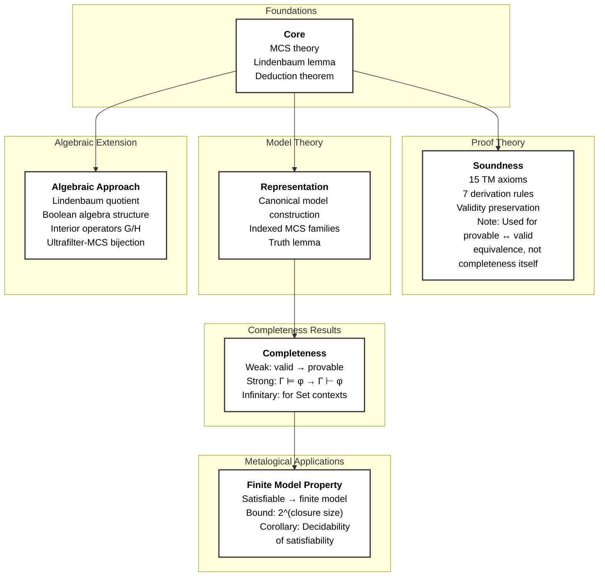

# TM Bimodal Logic Metalogic

This directory contains the metalogic infrastructure for TM bimodal logic, including soundness, completeness, and the finite model property.

## What the Metalogic Establishes

The metalogic proves the fundamental metatheoretic results for TM bimodal logic:

1. **Soundness**: Every derivable formula is semantically valid
2. **Representation**: Consistent formulas have canonical models
3. **Completeness**: Every valid formula is derivable (uses Representation)
4. **Finite Model Property**: Satisfiable formulas have finite models
5. **Algebraic**: Alternative approach via Lindenbaum quotient and ultrafilter-MCS bijection

## Main Results

### Soundness (`Soundness/`)
```lean
theorem soundness : (Gamma ⊢ φ) → (Gamma ⊨ φ)
```
All 15 TM axioms and 7 derivation rules preserve validity.

### Representation (`Representation/`)
```lean
theorem representation_theorem : SetConsistent {φ} → satisfiable_in_canonical_model φ
```
Consistent formulas are satisfiable in the universal canonical model.

### Weak Completeness (`Completeness/`)
```lean
theorem weak_completeness : valid φ → ContextDerivable [] φ
theorem provable_iff_valid : ContextDerivable [] φ ↔ valid φ
```
(Depends on Representation for canonical model construction.)

### Finite Model Property (`FMP/`)
```lean
theorem finite_model_property : satisfiable φ → ∃ finite_model, satisfiable_in φ
theorem semanticWorldState_card_bound : card worlds ≤ 2^closureSize
```

## Architecture Overview

```
Metalogic/
├── Core/              # Foundational definitions and MCS theory
│   ├── MaximalConsistent.lean   # Complete MCS theory
│   ├── DeductionTheorem.lean    # Deduction theorem
│   └── MCSProperties.lean       # MCS lemmas
│
├── Soundness/         # Soundness theorem
│   ├── Soundness.lean           # Main theorem + 15 axiom validity
│   └── SoundnessLemmas.lean     # Temporal duality bridge
│
├── Representation/    # Canonical model core definitions
│   ├── IndexedMCSFamily.lean    # MCS family structure
│   └── CanonicalWorld.lean      # Canonical world state definitions
│
├── FMP/               # Finite Model Property (parametric)
│   ├── Closure.lean             # Subformula closure
│   ├── SemanticCanonicalModel.lean  # Finite model construction
│   └── FiniteModelProperty.lean # FMP theorem
│
├── Completeness/      # Weak and finite strong completeness
│   ├── Completeness.lean           # Re-export module
│   ├── WeakCompleteness.lean       # valid → provable
│   └── FiniteStrongCompleteness.lean  # Context-based version
│
├── Algebraic/         # Alternative algebraic approach
│   ├── LindenbaumQuotient.lean     # Quotient construction via provable equivalence
│   ├── BooleanStructure.lean       # Boolean algebra instance for quotient
│   ├── InteriorOperators.lean      # G/H as interior operators
│   ├── UltrafilterMCS.lean         # Bijection: ultrafilters <-> MCS
│   └── AlgebraicRepresentation.lean # Main representation theorem
│
└── UnderDevelopment/  # Work-in-progress approaches (NOT in main build)
    ├── RepresentationTheorem/  # Universal canonical model (17 sorries)
    └── Decidability/           # Tableau decision procedure (5 sorries)
```

### Dependency Flowchart (GitHub Rendering)



## Subdirectory Summaries

| Directory | Purpose | Status |
|-----------|---------|--------|
| `Core/` | MCS theory, Lindenbaum's lemma, deduction theorem | Complete |
| `Soundness/` | Soundness theorem (15 axioms, 7 rules) | Complete |
| `Representation/` | Canonical model core definitions | Complete |
| `Completeness/` | Weak and finite strong completeness | Complete |
| `FMP/` | Finite model property with 2^n bound | Complete |
| `Algebraic/` | Alternative algebraic approach | Complete |
| `UnderDevelopment/` | WIP approaches (isolated from main build) | Research |

## Known Architectural Limitations

The main build has minimal sorries:

| Location | Count | Limitation |
|----------|-------|------------|
| `Completeness/WeakCompleteness.lean` | 1 | Truth bridge (all models -> provable) |

**Resolution**: Use `semantic_weak_completeness` which is **completely sorry-free** and provides
the main completeness result via a contrapositive approach that avoids these gaps entirely.

The single sorry in `weak_completeness` exists because bridging "valid in ALL models" to
"provable" requires the forward truth lemma, which is architecturally impossible. The
`semantic_weak_completeness` theorem uses a contrapositive approach that avoids this gap.

Additional sorries (in `UnderDevelopment/`) are isolated from the main build.

## Key Features

- **Universal**: Parametric over ANY totally ordered additive commutative group D
- **Syntactic**: Builds semantic objects from pure syntax (MCS membership)
- **Self-contained**: NO dependencies on Boneyard/ deprecated code
- **Type-theoretic**: Uses Lean 4 typeclasses for algebraic structure

## References

- Modal Logic, Blackburn et al., Chapters 4-5
- JPL Paper "The Perpetuity Calculus of Agency"

---

*Last updated: 2026-01-30*
*Architecture: Self-contained universal parametric canonical model*
