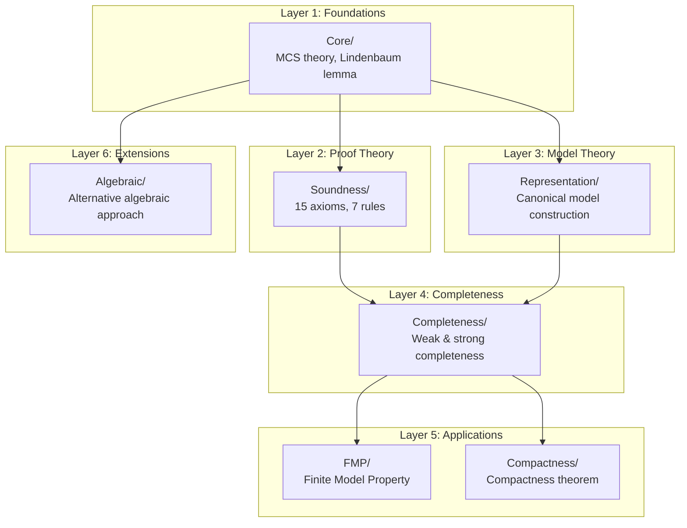

# Implementation Plan: Task #766

- **Task**: 766 - improve_metalogic_documentation_ordering
- **Status**: [COMPLETED]
- **Effort**: 2 hours
- **Priority**: Medium
- **Dependencies**: None
- **Research Inputs**: specs/766_improve_metalogic_documentation_ordering/reports/research-001.md
- **Artifacts**: plans/implementation-001.md (this file)
- **Standards**: plan-format.md, status-markers.md, artifact-management.md, tasks.md
- **Type**: markdown
- **Lean Intent**: false

## Overview

This task improves the Metalogic documentation by reordering sections to match actual dependency structure. The research report identified multiple ordering issues where results are presented before their dependencies (e.g., Completeness before Representation). Additionally, the Algebraic module is incorrectly described as "future extension" when it is complete, the dependency diagram is wrong (shows FMP before Completeness), and Metalogic.lean lacks imports for Completeness and Compactness.

### Research Integration

Key findings from research-001.md:
- Lines 8-13 in README.md present Completeness (#2) before Representation (#3), violating dependency order
- The "Dependency Layers" diagram (lines 83-101) incorrectly places FMP at Layer 4 and Completeness at Layer 5
- Algebraic module has 5 complete sorry-free files but is labeled "Future extension infrastructure"
- Metalogic.lean only imports FMP, missing Completeness, Compactness, and Algebraic modules

## Goals & Non-Goals

**Goals**:
- Reorder all documentation sections to reflect actual dependency structure (Soundness -> Representation -> Completeness -> FMP/Compactness -> Algebraic)
- Fix the dependency layers diagram to show correct order
- Update Algebraic module status from "future" to "complete"
- Add missing imports to Metalogic.lean
- Create a Mermaid dependency flowchart for GitHub rendering

**Non-Goals**:
- Changing any Lean code logic or proofs
- Restructuring the directory hierarchy
- Adding new theorem documentation

## Risks & Mitigations

| Risk | Impact | Likelihood | Mitigation |
|------|--------|------------|------------|
| README changes conflict with recent Task 764 updates | Low | Low | Verify against current file state before editing |
| Mermaid rendering issues in some viewers | Low | Medium | Provide fallback ASCII diagram in collapsed section |
| Metalogic.lean import changes affect build | Low | Low | Run `lake build` after changes to verify |

## Implementation Phases

### Phase 1: Reorder README.md Sections [COMPLETED]

**Goal**: Fix all ordering issues in README.md to match actual dependency structure

**Tasks**:
- [ ] Reorder "What the Metalogic Establishes" list (lines 8-13): move Representation before Completeness
- [ ] Reorder "Main Results" section (lines 17-43): move Representation before Weak Completeness
- [ ] Reorder "Subdirectory Summaries" table (lines 105-113): change from alphabetical to dependency order

**Timing**: 30 minutes

**Files to modify**:
- `Theories/Bimodal/Metalogic/README.md` - reorder sections to: Core -> Soundness -> Representation -> Completeness -> FMP -> Compactness -> Algebraic

**Verification**:
- All sections list results in dependency order
- No logical prerequisites appear after dependent results

---

### Phase 2: Fix Dependency Layers Diagram [COMPLETED]

**Goal**: Correct the ASCII dependency diagram to show Completeness at Layer 4 and FMP/Compactness at Layer 5

**Tasks**:
- [ ] Update Layer 4 from "FMP/" to "Completeness/"
- [ ] Update Layer 5 from "Completeness/ -- Compactness/" to "FMP/ -- Compactness/"
- [ ] Update layer labels (Finiteness -> Completeness, Results -> Applications)

**Timing**: 15 minutes

**Files to modify**:
- `Theories/Bimodal/Metalogic/README.md` - lines 83-101, fix layer assignments

**Verification**:
- Diagram shows Completeness at Layer 4
- FMP and Compactness both at Layer 5 (both depend on Completeness)

---

### Phase 3: Update Algebraic Module Documentation [COMPLETED]

**Goal**: Accurately document the Algebraic module as complete, not future work

**Tasks**:
- [ ] Change line 76 from "Future extension infrastructure" to "Alternative algebraic approach (sorry-free)"
- [ ] Add missing files to architecture listing: BooleanStructure.lean, InteriorOperators.lean, AlgebraicRepresentation.lean
- [ ] Update Metalogic.lean doc comment line 27 from "(future extension)" to "(complete)"

**Timing**: 20 minutes

**Files to modify**:
- `Theories/Bimodal/Metalogic/README.md` - update Algebraic description and file list
- `Theories/Bimodal/Metalogic/Metalogic.lean` - update doc comment

**Verification**:
- Algebraic module described as "sorry-free" or "complete"
- All 5 Algebraic files listed in architecture section

---

### Phase 4: Add Missing Metalogic.lean Imports [COMPLETED]

**Goal**: Ensure Metalogic.lean exports all major modules for users

**Tasks**:
- [ ] Add `import Bimodal.Metalogic.Completeness.Completeness`
- [ ] Add `import Bimodal.Metalogic.Compactness.Compactness`
- [ ] Add `import Bimodal.Metalogic.Algebraic.Algebraic` (or comment as optional extension)
- [ ] Run `lake build` to verify no errors

**Timing**: 15 minutes

**Files to modify**:
- `Theories/Bimodal/Metalogic/Metalogic.lean` - add import statements

**Verification**:
- `lake build Bimodal.Metalogic.Metalogic` succeeds
- All major module exports available

---

### Phase 5: Create Mermaid Dependency Flowchart [COMPLETED]

**Goal**: Add a visual dependency flowchart that renders on GitHub

**Tasks**:
- [ ] Add Mermaid flowchart after the ASCII dependency diagram
- [ ] Include all 6 layers with subdirectory descriptions
- [ ] Show dependency arrows between layers
- [ ] Optionally add collapsible ASCII fallback for non-Mermaid viewers

**Timing**: 20 minutes

**Files to modify**:
- `Theories/Bimodal/Metalogic/README.md` - add Mermaid diagram section

**Mermaid Template**:

**Verification**:
- Mermaid renders correctly on GitHub
- All dependencies shown with arrows
- Subgraph labels match layer names

---

### Phase 6: Sync Metalogic.lean Documentation [COMPLETED]

**Goal**: Ensure Metalogic.lean doc comment matches README structure

**Tasks**:
- [ ] Update the dependency layers diagram in doc comment (lines 32-50) to match corrected README
- [ ] Verify Main Results section order matches README
- [ ] Update any "future extension" references

**Timing**: 20 minutes

**Files to modify**:
- `Theories/Bimodal/Metalogic/Metalogic.lean` - update doc comment to match README

**Verification**:
- Doc comment diagram matches README diagram exactly
- No references to Algebraic as "future"

---

## Testing & Validation

- [ ] All README sections follow dependency order: Soundness -> Representation -> Completeness -> FMP/Compactness -> Algebraic
- [ ] Dependency diagram shows Completeness at Layer 4, FMP/Compactness at Layer 5
- [ ] Algebraic module documented as complete/sorry-free
- [ ] `lake build Bimodal.Metalogic.Metalogic` succeeds with new imports
- [ ] Mermaid flowchart renders correctly on GitHub

## Artifacts & Outputs

- `Theories/Bimodal/Metalogic/README.md` - reordered and corrected documentation
- `Theories/Bimodal/Metalogic/Metalogic.lean` - updated imports and doc comment
- `specs/766_improve_metalogic_documentation_ordering/summaries/implementation-summary-YYYYMMDD.md` - completion summary

## Rollback/Contingency

If changes introduce issues:
1. Revert README.md changes via `git checkout HEAD -- Theories/Bimodal/Metalogic/README.md`
2. Revert Metalogic.lean changes via `git checkout HEAD -- Theories/Bimodal/Metalogic/Metalogic.lean`
3. If build fails after import changes, remove the new imports and investigate module dependencies
