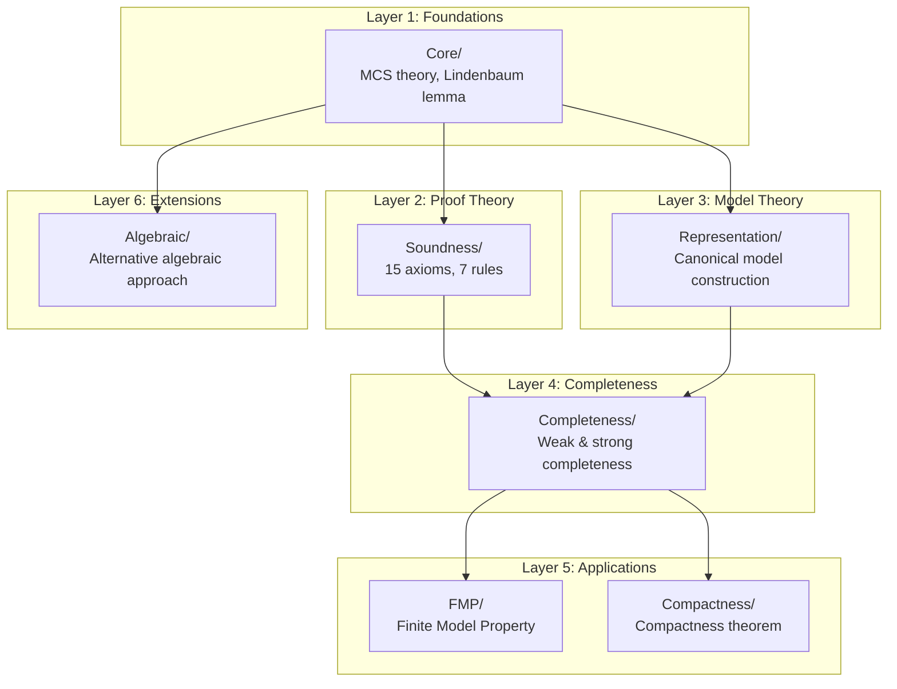

# Research Report: Task #766

**Task**: 766 - improve_metalogic_documentation_ordering
**Started**: 2026-01-29T00:00:00Z
**Completed**: 2026-01-29T00:15:00Z
**Effort**: small
**Priority**: medium
**Dependencies**: None
**Sources/Inputs**: Codebase analysis of Theories/Bimodal/Metalogic/
**Artifacts**: specs/766_improve_metalogic_documentation_ordering/reports/research-001.md
**Standards**: report-format.md, subagent-return.md

## Executive Summary

- The README.md "What the Metalogic Establishes" list (lines 8-13) presents results OUT OF ORDER relative to their actual dependencies: Completeness (2) depends on Representation (3), and both FMP and Compactness depend on Completeness
- The Metalogic.lean file only imports FMP, missing Completeness, Compactness, and Algebraic modules
- The Algebraic module is fully implemented with 5 files (sorry-free) but is labeled "Future extension infrastructure" despite being complete
- The "Dependency Layers" diagram is INCORRECT: FMP depends on Completeness, not the other way around
- A dependency flowchart should use Mermaid syntax for GitHub rendering

## Context & Scope

This research analyzes the documentation structure of Theories/Bimodal/Metalogic/ to identify ordering issues where results are presented before their dependencies are established. The task also includes documenting the Algebraic module status and designing a dependency flowchart.

**Files Examined**:
- Theories/Bimodal/Metalogic/README.md (153 lines)
- Theories/Bimodal/Metalogic/Metalogic.lean (main module file)
- All 31 Lean files under Metalogic/ (import structure analysis)

## Findings

### 1. Documentation Ordering Issues in README.md

**Issue A: "What the Metalogic Establishes" Section (Lines 8-13)**

Current order:
```
1. Soundness
2. Completeness      <-- PROBLEM: depends on Representation (#3)
3. Representation    <-- SHOULD come before Completeness
4. Finite Model Property
5. Compactness
```

The TRUE dependency order (from import analysis):
```
1. Soundness (depends on: Core)
2. Representation (depends on: Core)
3. Completeness (depends on: Representation, Soundness)
4. FMP (depends on: Completeness)
5. Compactness (depends on: Completeness)
```

**Issue B: "Main Results" Section (Lines 17-43)**

Presents results in order:
1. Soundness
2. Weak Completeness
3. Representation
4. FMP
5. Compactness

Completeness (2) again appears BEFORE Representation (3). WeakCompleteness.lean imports `UniversalCanonicalModel` from Representation.

**Issue C: "Dependency Layers" Diagram (Lines 83-101)**

Current diagram shows:
```
Layer 4: FMP/
Layer 5: Completeness/ -- Compactness/
```

This is INCORRECT. From actual imports:
- FMP/FiniteModelProperty.lean imports `Completeness.WeakCompleteness`
- FMP/SemanticCanonicalModel.lean imports `Completeness.WeakCompleteness`
- Compactness/Compactness.lean imports `Completeness.InfinitaryStrongCompleteness`

Correct ordering:
```
Layer 4: Completeness/
Layer 5: FMP/ -- Compactness/
```

**Issue D: Subdirectory Table (Lines 105-113)**

Lists directories in alphabetical order rather than dependency order. Should reorder to:
Core -> Soundness -> Representation -> Completeness -> FMP -> Compactness -> Algebraic

### 2. Metalogic.lean Module Imports

**Current state (line 5):**
```lean
import Bimodal.Metalogic.FMP
```

**Missing imports:**
- `Bimodal.Metalogic.Completeness.Completeness` (re-exports all completeness results)
- `Bimodal.Metalogic.Compactness.Compactness`
- `Bimodal.Metalogic.Algebraic.Algebraic` (if Algebraic should be exported)

### 3. Algebraic Module Status

**Current description** (README.md lines 76-78):
```
└── Algebraic/         # Future extension infrastructure
    ├── LindenbaumQuotient.lean  # Lindenbaum-Tarski algebra
    └── UltrafilterMCS.lean      # Ultrafilter correspondence
```

**Actual state** (5 complete files):
```
Algebraic/
├── LindenbaumQuotient.lean      # Quotient construction via provable equivalence
├── BooleanStructure.lean        # Boolean algebra instance for quotient
├── InteriorOperators.lean       # G/H as interior operators
├── UltrafilterMCS.lean          # Bijection: ultrafilters <-> MCS
├── AlgebraicRepresentation.lean # Main representation theorem (sorry-free)
└── Algebraic.lean               # Module aggregator (imports all above)
```

**Status**: The module is **COMPLETE** (sorry-free), not "in development" or "future extension". The table at lines 105-113 correctly shows it as "Sorry-free (extension)" but the architecture section and descriptions are misleading.

The Algebraic module provides an alternative algebraic approach to the representation theorem. Files AlgebraicSemanticBridge.lean and HybridCompleteness.lean were archived (Task 750) due to Box semantics limitations.

### 4. Dependency Flowchart Design

Recommended Mermaid flowchart for GitHub rendering:



### 5. Import Dependency Summary

**Core/** (Layer 1):
- DeductionTheorem.lean: imports ProofSystem
- MaximalConsistent.lean: imports Core.DeductionTheorem
- MCSProperties.lean: imports Core.MaximalConsistent, Core.DeductionTheorem
- Core.lean: imports all Core/*

**Soundness/** (Layer 2):
- SoundnessLemmas.lean: imports Semantics.Truth, ProofSystem
- Soundness.lean: imports Soundness.SoundnessLemmas

**Representation/** (Layer 3):
- CanonicalWorld.lean: imports Core.MaximalConsistent, Core.MCSProperties
- IndexedMCSFamily.lean: imports Core.MaximalConsistent, Representation.CanonicalWorld
- TaskRelation.lean: imports Representation.CanonicalWorld
- CanonicalHistory.lean: imports Representation.TaskRelation, Representation.IndexedMCSFamily
- CoherentConstruction.lean: imports Core.*, Representation.IndexedMCSFamily
- TruthLemma.lean: imports Representation.CanonicalHistory, Representation.IndexedMCSFamily
- UniversalCanonicalModel.lean: imports Representation.TruthLemma, Representation.CoherentConstruction

**Completeness/** (Layer 4):
- WeakCompleteness.lean: imports Representation.UniversalCanonicalModel, Soundness.Soundness
- FiniteStrongCompleteness.lean: imports Completeness.WeakCompleteness
- InfinitaryStrongCompleteness.lean: imports Completeness.FiniteStrongCompleteness, Representation.UniversalCanonicalModel
- Completeness.lean: imports all Completeness/*

**FMP/** (Layer 5):
- Closure.lean: imports Core.MaximalConsistent, ProofSystem
- BoundedTime.lean: imports Mathlib only (no local deps)
- FiniteWorldState.lean: imports Core.MaximalConsistent, FMP.Closure, FMP.BoundedTime
- SemanticCanonicalModel.lean: imports FMP.FiniteWorldState, **Completeness.WeakCompleteness**
- FiniteModelProperty.lean: imports FMP.SemanticCanonicalModel, **Completeness.WeakCompleteness**
- FMP.lean: imports all FMP/*

**Compactness/** (Layer 5):
- Compactness.lean: imports **Completeness.InfinitaryStrongCompleteness**

**Algebraic/** (Layer 6):
- LindenbaumQuotient.lean: imports Core.MaximalConsistent
- BooleanStructure.lean: imports Algebraic.LindenbaumQuotient
- InteriorOperators.lean: imports Algebraic.BooleanStructure, Core.MCSProperties
- UltrafilterMCS.lean: imports Algebraic.InteriorOperators, Core.MaximalConsistent
- AlgebraicRepresentation.lean: imports Algebraic.UltrafilterMCS
- Algebraic.lean: imports all Algebraic/*

## Recommendations

### 1. Reorder "What the Metalogic Establishes" (Lines 8-13)

Change from:
```markdown
1. **Soundness**: Every derivable formula is semantically valid
2. **Completeness**: Every valid formula is derivable
3. **Representation**: Consistent formulas have canonical models
4. **Finite Model Property**: Satisfiable formulas have finite models
5. **Compactness**: Infinite satisfiability reduces to finite satisfiability
```

To:
```markdown
1. **Soundness**: Every derivable formula is semantically valid
2. **Representation**: Consistent formulas have canonical models
3. **Completeness**: Every valid formula is derivable (uses Representation)
4. **Finite Model Property**: Satisfiable formulas have finite models
5. **Compactness**: Infinite satisfiability reduces to finite satisfiability
```

### 2. Reorder "Main Results" Section

Move Representation before Completeness (lines 29-32 before lines 23-27).

### 3. Fix Dependency Layers Diagram

Replace current diagram (lines 83-101) with the correct Mermaid flowchart above, or at minimum fix the text diagram to show:
```
Layer 4 (Completeness):
    Completeness/
      │
Layer 5 (Applications):
    FMP/ ── Compactness/
```

### 4. Update Algebraic Module Description

Line 76: Change "Future extension infrastructure" to "Alternative algebraic approach (sorry-free)"

Add the 3 missing files to the architecture listing (BooleanStructure.lean, InteriorOperators.lean, AlgebraicRepresentation.lean).

### 5. Update Metalogic.lean Imports

Add:
```lean
import Bimodal.Metalogic.Completeness.Completeness
import Bimodal.Metalogic.Compactness.Compactness
-- Optionally: import Bimodal.Metalogic.Algebraic.Algebraic
```

### 6. Reorder Subdirectory Table

Change alphabetical order to dependency order:
1. Core/
2. Soundness/
3. Representation/
4. Completeness/
5. FMP/
6. Compactness/
7. Algebraic/

## Decisions

1. Use Mermaid syntax for the dependency flowchart (GitHub-native rendering)
2. Preserve all existing content while reordering for clarity
3. Update Algebraic status from "future" to "complete alternative"
4. Keep Algebraic import in Metalogic.lean optional (commented) since it's an extension

## Risks & Mitigations

| Risk | Impact | Mitigation |
|------|--------|------------|
| README changes may conflict with recent Task 764 updates | Low | Verify against current README state |
| Mermaid rendering may not work in all contexts | Low | Provide ASCII fallback in collapsed section |
| Metalogic.lean import changes affect build | Low | Test with `lake build` after changes |

## Appendix

### Files Analyzed
- /home/benjamin/Projects/ProofChecker/Theories/Bimodal/Metalogic/README.md
- /home/benjamin/Projects/ProofChecker/Theories/Bimodal/Metalogic/Metalogic.lean
- All 31 *.lean files under Metalogic/ (via grep for imports)

### Search Queries Used
- `Glob pattern: **/*.lean` in Metalogic/
- `Grep pattern: ^import` to extract all import statements

### Key Line Numbers in README.md
- Lines 8-13: "What the Metalogic Establishes" list
- Lines 17-43: "Main Results" section
- Lines 47-79: "Architecture Overview"
- Lines 83-101: "Dependency Layers" diagram
- Lines 105-113: "Subdirectory Summaries" table
